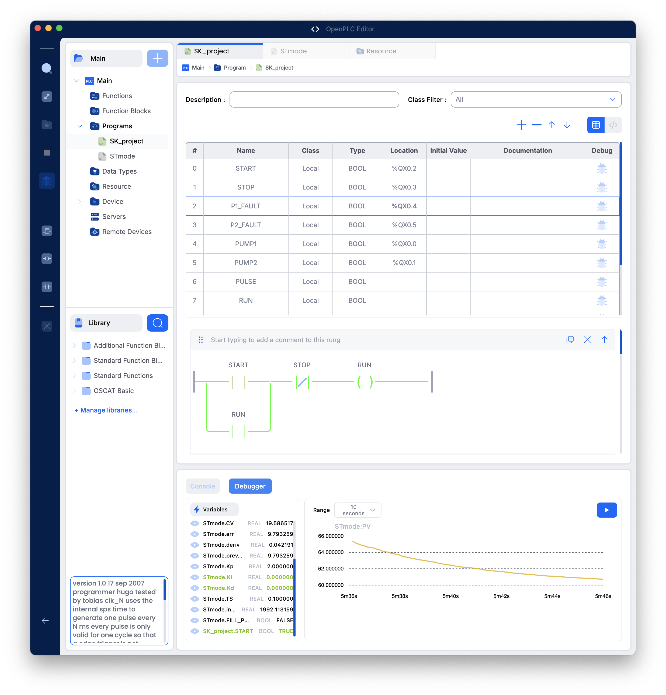
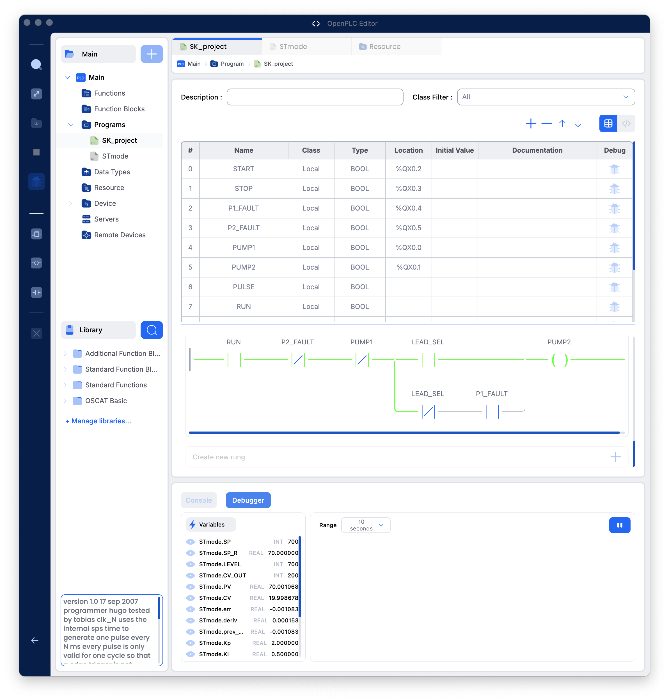
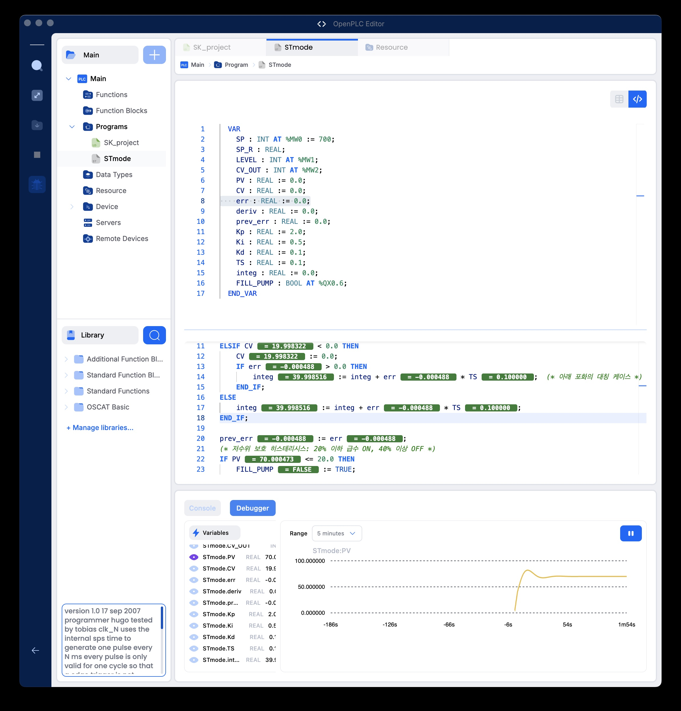
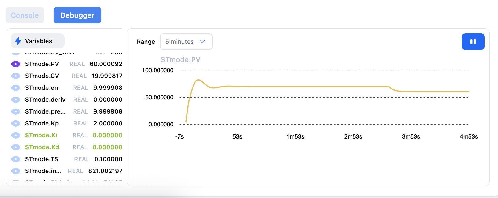
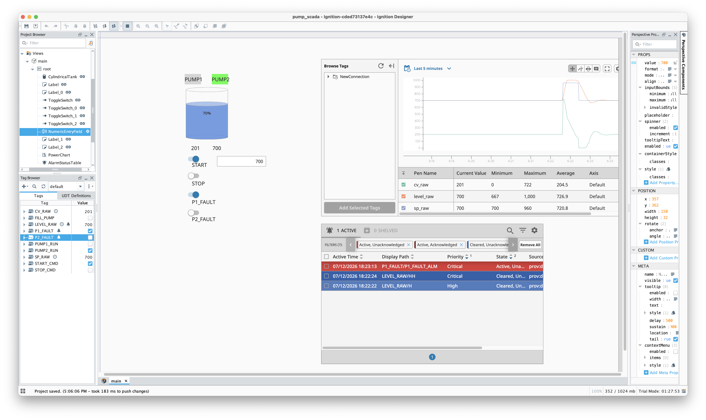
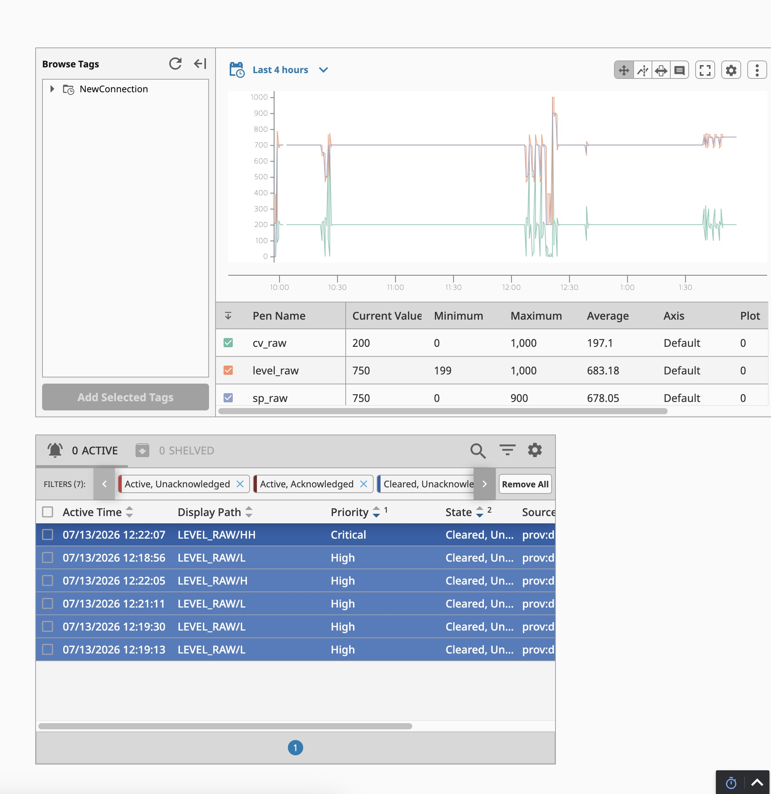
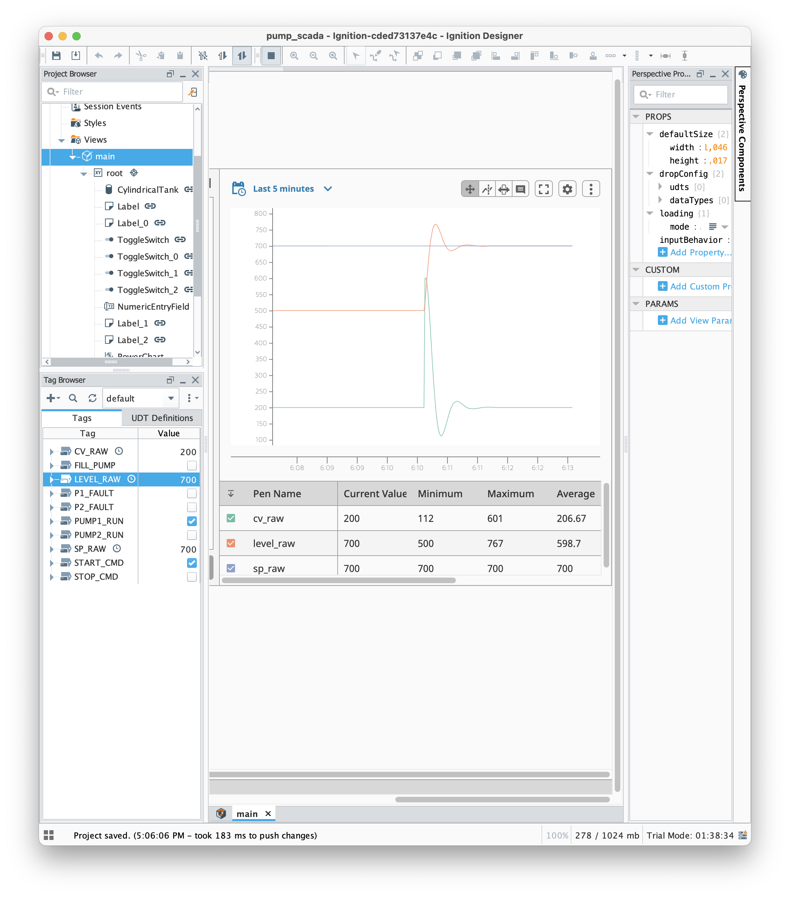

# PCW HMI 시뮬레이터

**[▶ 시뮬레이터 실행](https://jiu7021.github.io/pcw-hmi/)**

반도체 공장에서 설비를 식혀주는 냉각수 순환 시스템을, 실물 장비 없이
브라우저에서 직접 눌러볼 수 있게 재현한 시뮬레이터입니다.

**⚠ 실물 PLC/센서에 연결되어 있지 않습니다.** 화면에 보이는 모든 값과
움직임은 브라우저 안에서 돌아가는 수치 모델이 계산한 것입니다.

## 어떻게 만들었나

이 프로젝트는 에이전트형 AI 코딩 도구 **Claude Code**로 구현했습니다. AI가
그럴듯하지만 근거 없는 숫자를 만들어내지 않도록, 프로젝트 규칙 파일
([CLAUDE.md](CLAUDE.md))에 "근거 없는 상수 금지", "불확실한 정보는 임의로
채우지 말고 사람에게 물을 것", "계산 기준·단위·(존재하지 않는) 미래 데이터
미참조" 같은 제약을 미리 정해 모든 작업에 상시 적용했습니다.

검증은 사람 눈이 아니라 코드가 하게 만들었습니다 — 안전 조건을 자동으로
검사하는 스위트를 따로 구축해, 로직을 한 줄이라도 고칠 때마다 전 시나리오를
자동으로 재검사합니다. 시뮬레이터를 브라우저에서 직접 실행시켜 동작을
눈으로 확인하는 검증도 병행했습니다(예: 바이패스로 전환된 펌프를 정지시켰다가
다시 기동시켜, 그때 전압강하가 실제로 기록되는지 직접 확인). 그 결과 화면
만으로는 보이지 않던 결함을 여러 건 찾아 고쳤습니다 — 온도 제어의 적분
포화 판정이 한 틱 늦게 걸려 불필요하게 계속 쌓이던 결함(자동 검증이 발견),
보호 트립 원인이 아직 안 풀렸는데도 리셋이 그냥 허용되던 안전 허점(직접
화면을 조작해보다가 발견), 유량 제어의 상한값이 근거 없이 정해져 있던 것을
찾아 펌프의 실제 물리적 최대 용량 기준으로 다시 계산한 것(그 과정에서 같은
종류의 문제가 하한값에도 숨어 있던 것까지 추가로 발견).

## 1. 원본 구현 (OpenPLC + Ignition)

이 프로젝트는 원래 실물에 가까운 산업용 SCADA 구성으로 먼저 만들었습니다.
제어 로직은 오픈소스 PLC 런타임인 **OpenPLC**에 Ladder Diagram/Structured
Text로 직접 짜고, 감시 화면은 실제 현장에서 쓰이는 SCADA 툴인 **Ignition
Perspective**로 Modbus TCP를 통해 PLC와 통신하며 만들었습니다. 아래는 그
구현 과정의 스크린샷입니다.



**자기유지 회로** — START를 한 번 누르면 손을 떼도 계속 운전하고, STOP을
눌러야 멈추는 가장 기본적인 래더 로직입니다. 릴레이 제어의 기본 단위입니다.



**펌프 교번·백업 로직** — 여러 대의 펌프를 돌아가며 고르게 쓰고, 한 대가
고장 나면 대기 중이던 펌프가 자동으로 대신 투입되며, 두 대가 동시에
기동하지 않도록 막는 로직입니다.



**PID 제어와 저수위 보호 로직** — Structured Text로 짠 온도 제어(PID)와,
수위가 너무 낮아지면 펌프를 보호하는 인터록 로직입니다.



**P(비례)만 썼을 때의 응답** — 적분(I) 없이 비례항만으로 제어하면
목표값에 끝까지 도달하지 못하고 일정한 편차가 남는 것을 실측으로 보여주는
그래프입니다. 아래 "5. 이 시뮬레이터로 확인할 수 있는 것"에서 이 문제를
다시 다룹니다.



**Ignition 감시 화면(HMI)** — 수조·펌프 상태를 한눈에 보고, 고장을 걸거나
운전 조작을 할 수 있는 SCADA 화면입니다.



**트렌드와 알람 관리** — 시간에 따른 값 변화를 그래프로 보고, 알람이
발생·해소된 이력을 관리하는 화면입니다.



**설정값(SP) 변경 시 응답** — 목표 온도를 바꿨을 때 실제 값이 어떻게
따라가는지 보여주는 트렌드입니다.

## 2. 왜 확장했나

원본 구현은 실물 PLC와 로컬 SCADA 서버가 있어야 동작해서, 링크 하나로
다른 사람에게 보여줄 방법이 없었습니다. 또 실물 설비가 없다 보니 전동기
전류, 모선전압, 센서 오차 같은 실무에서 실제로 중요한 계층은 다뤄볼
기회가 없었습니다.

그래서 같은 제어 로직(자기유지, 교번운전, 캐스케이드 PID, 인터록 등)을
그대로 가져와, 반도체 팹의 공정냉각수(PCW) 설비 규모로 키우고, 브라우저
안에서 통째로 돌아가는 시뮬레이터로 다시 만들었습니다. 실물 PLC나
서버 없이 이 저장소를 열기만 하면 누구나 링크로 확인할 수 있습니다.
(어떤 도구로, 어떻게 검증하며 만들었는지는 위 "어떻게 만들었나" 참조.)

## 3. 이 시뮬레이터가 하는 일

반도체 장비에서 나오는 열을 냉각수가 흡수해서 실어 나르고, 그 냉각수의
온도를 설정값 그대로 유지하기 위해 펌프 3대의 속도와 운전 대수를 자동으로
조절하는 시스템입니다. 부하(장비가 뿜어내는 열)가 커지면 펌프가 더 빨리
돌거나 대수를 늘리고, 부하가 줄면 반대로 줄입니다. 펌프 한 대가 고장
나면 대기 중이던 펌프가 자동으로 대신 투입되어 냉각이 끊기지 않습니다.

## 4. 화면 사용법

| 항목 | 무엇을 하는가 | 누르면 무엇을 보게 되는가 |
|---|---|---|
| START / STOP | 계통 기동·정지 | START를 누르면 펌프가 순서대로 돌기 시작해 온도가 설정값으로 수렴하고, STOP을 누르면 전부 멈춥니다 |
| SP 입력 | 목표 공급온도 변경 | 값을 바꾸면 유량·속도가 새 목표를 향해 재조정되는 과정이 트렌드에 나타납니다 |
| AUTO / MANUAL | 자동 제어 vs 수동 속도 지정 | MANUAL에서 속도를 직접 올리면 PID가 관여하지 않고 그 속도로 고정 운전됩니다 |
| 배속(1x/5x/20x) | 시뮬레이션 진행 속도 조절 | 20x로 두면 몇 분짜리 정착 과정을 몇 초 만에 볼 수 있습니다(물리적인 결과 자체는 배속과 무관하게 동일합니다) |
| 고정 부하 모드 | 부하를 한 값에 고정 | 계통이 안정된 뒤 아래 외란 버튼만으로 순수한 응답을 관찰할 수 있습니다(기본값인 "연속 순환" 모드는 정상상태에 이르기 전에 다음 부하 단계로 넘어가 버립니다) |
| 열부하 외란 인가 | 온도 쪽에 순간적인 부하 스텝을 줌 | 온도가 먼저 흔들리고 거기서 유량 조정이 파생되는 경로의 외란입니다 — 이 경우 단일루프가 더 빨리 회복합니다 |
| 유량측 외란 | 배관저항 급증/공급압력 저하를 흉내 | 펌프 속도는 그대로인데 실제로 통과하는 유량만 줄어드는 외란입니다 — 이 경우 캐스케이드가 더 빨리 회복합니다 |
| 펌프 고장 주입 | 특정 펌프를 강제로 FAULT 처리 | 그 펌프가 즉시 제외되고, 대기 중이던 펌프가 자동으로 대신 투입되는 과정을 볼 수 있습니다 |
| VFD 고장 주입 | 그 펌프의 속도제어(VFD)를 강제로 못 쓰게 함 | 상용전원 직입(바이패스)으로 전환되어 고정속 운전으로 바뀌고, 나머지 펌프가 부족분을 메우며 온도를 다시 맞추는 과정을 볼 수 있습니다 |
| 센서 열화 토글 | 온도 센서를 서서히 부정확해지게 만듦 | 참값과 측정값이 점점 벌어지는데도 진단 알람은 뜨지 않는 것을 눈으로 확인할 수 있습니다 — 이런 종류의 고장이 왜 잡기 어려운지 보여주기 위한 것입니다 |
| 자동 측정 패널 | 외란 전후 응답을 자동으로 채점 | 버튼을 누른 시점을 기준으로 최대편차·회복시간이 캐스케이드/단일루프 각각 자동으로 기록되고 이력에 쌓입니다 |

## 5. 이 시뮬레이터로 확인할 수 있는 것

### 기본: PID 제어

**문제**: 원본 구현의 04번 이미지가 그 증거입니다 — 비례(P)만 써서
제어하면, 오차가 작아질수록 그 오차를 밀어내는 힘도 같이 작아지기
때문에 목표값에 끝까지 도달하지 못하고 약간의 편차가 계속 남습니다.

**해법**: 적분(I)을 더하면, 오차가 남아있는 한 그 오차가 시간이 지날수록
계속 쌓여서 결국 오차를 완전히 밀어냅니다. 그래서 정상상태에서 편차가
0에 수렴합니다.

**화면에서 확인하는 법**: 튜닝 패널의 P만 / PI / PID 프리셋을 눌러가며
같은 조건에서 응답이 어떻게 달라지는지 트렌드로 직접 비교할 수 있습니다.

### ① 캐스케이드 제어

**문제**: 온도는 열교환기를 거치며 천천히 변하는 "느린" 값입니다. 온도만
보고 펌프 속도를 조절하면, 실제로 유량에 문제가 생긴 뒤에도 그게 온도에
반영되어 눈에 띌 때까지 한참 기다려야 알아챌 수 있습니다.

**해법**: 온도와 펌프 속도 사이에 유량이라는 "빠른" 변수를 하나 더
두고, 유량을 전담으로 빠르게 조절하는 루프를 안쪽에 하나 더 만듭니다.
유량이 흔들리면 온도까지 번지기 전에 안쪽 루프가 먼저 잡아줍니다.

**중요한 조건**: 이 이점은 공짜가 아닙니다 — **열부하 쪽에 외란이
들어올 때는 캐스케이드가 오히려 불리합니다**(온도오차→유량목표→
유량오차→속도지령으로 이어지는 두 단계를 거치며 반응이 늦어지기
때문). 캐스케이드가 진짜 유리한 건 **유량 쪽에 직접 외란이 들어올
때**뿐입니다 — 안쪽 루프가 그 문제를 온도에 닿기 전에 바로 감지하기
때문입니다.

**화면에서 확인하는 법**: "열부하 외란"과 "유량측 외란" 두 버튼으로
같은 조건에서 캐스케이드/단일루프 비교선(회색 점선 2종)이 어떻게
다르게 반응하는지 비교할 수 있습니다. 자동 측정 패널을 켜두면 최대편차·
회복시간이 숫자로도 나옵니다.

### ② 히스테리시스와 대수제어

**문제**: 펌프를 몇 대 돌릴지 기준값 하나로만 판단하면(예: "속도가
90% 넘으면 한 대 더 켠다"), 값이 그 기준 근처에서 미세하게 오르내릴 때마다
펌프가 계속 켜졌다 꺼졌다를 반복합니다(헌팅).

**해법**: 켜는 기준과 끄는 기준을 서로 다르게 벌려두고, 각각 일정 시간
동안 유지될 때만 실제로 켜거나 끄도록 지연을 둡니다. 여기서는 끄는
쪽의 지연을 켜는 쪽보다 더 길게 뒀는데, 펌프를 너무 성급하게 빼버리면
금방 다시 필요해져서 왔다갔다하기 쉽고, 무엇보다 유량이 부족해지는
것보다는 펌프를 조금 더 오래 돌리는 쪽이 안전하기 때문입니다.

**화면에서 확인하는 법**: 부하 프로파일을 "연속 순환"으로 두고 트렌드와
"운전 정보" 패널을 보면, 부하가 오를 때 펌프가 한 대씩 순서대로 투입되고
자주 껐다 켰다 하지 않는 것을 확인할 수 있습니다.

### ③ Anti-windup

**문제**: 펌프 속도가 이미 최대(100%)인데 온도 오차가 여전히 남아있으면,
적분값은 그 오차를 계속 쌓아 올립니다. 나중에 부하가 줄어들어 오차가
반대로 바뀌어도, 쌓여있던 적분값이 다 풀릴 때까지는 출력이 내려오지
않아서 이번엔 반대 방향으로 크게 벗어납니다.

**해법**: 출력이 한계에 닿아있는 동안에는 그 한계를 더 심화시키는
방향의 오차는 적분에 반영하지 않고 멈추되, 한계에서 벗어나는(=풀어주는)
방향의 오차는 계속 반영합니다. 그래야 출력이 한계에서 벗어나야 할
순간에 곧바로 반응할 수 있습니다.

**검증 중 실제로 발견한 결함**: 이 판정을 "이번 오차를 반영하기 전"
기준으로 하면 한 틱 늦게 멈추는 결함이 있었습니다 — 자동 검증 스위트가
이걸 실제로 잡아냈고, "반영한 뒤" 기준으로 고쳐서 해결했습니다. 아래
"검증 결과" 절에 발견 경위와 수정 내역을 그대로 남겨두었습니다.

---

## 더 자세히

아래부터는 위 1~5절에서 다룬 내용을 더 깊이 알고 싶은 사람을 위한
상세 자료입니다 — 실행 방법, 코드 구조, 정확한 상수·수식과 그 근거,
전체 검증 결과를 담고 있습니다.

<details>
<summary><b>실행 방법 — 로컬에서 여는 법, 배포, 의존성</b></summary>

## 실행 방법

별도 빌드 과정 없이 `index.html`을 브라우저로 열면 바로 동작합니다.
GitHub Pages로 배포할 경우 저장소 루트를 그대로 서빙하면 됩니다
(`index.html`이 같은 폴더의 `sim-*.js` 모듈들을 `<script src>`로 불러옵니다).

외부 의존성은 트렌드 차트용 [Chart.js](https://www.chartjs.org/) 1개만
CDN으로 로드합니다. 그 외 UI(P&ID 계통도 등)는 인라인 SVG로 직접 그립니다.

</details>

<details>
<summary><b>코드 구조 — 파일 구성과 모듈 간 의존 관계</b></summary>

## 코드 구조

```
index.html            브라우저 UI 레이어 — DOM/SVG/Chart.js 렌더링, 이벤트 바인딩만.
sim-core.js            제어 로직(캐스케이드 PID, 대수제어, 인터록) + 플랜트
                       물리모델(열교환기/펌프/탱크). DOM 비의존 순수 계산 모듈(UMD).
sim-electrical.js      전동기 전류모델 + 모선(전원임피던스) 전압강하 + 보호
                       (과부하 열특성, 결상). sim-core.js를 몰라도 되는 독립 모듈.
sim-power-quality.js   모선전압 고속 샘플링 + sag 검출/원인분류 + ESS/PCS 대응.
                       sim-electrical.js의 출력을 입력으로 받는다.
sim-sensors.js         가상 센서(범위/분해능/1차지연/노이즈/열화) + 진단
                       (범위이탈/고착/정합성 교차확인).
sim-plant.js           위 4개 모듈을 한 틱 안에서 순서대로 엮는 오케스트레이터.
                       index.html과 tests/ 둘 다 이걸 통해 전체 계층을 돌린다.
tests/                 헤드리스 자동 검증 스위트(아래 "자동 검증" 절 참조).
```

각 `sim-*.js`는 브라우저에서는 `<script src>`로 전역(`SimCore`, `ElecLayer`,
`PQLayer`, `SensorLayer`, `SimPlant`)에 붙고, Node.js에서는
`require('./sim-xxx.js')`로 그대로 불러 쓸 수 있는 UMD 모듈입니다. 계층 간
의존은 단방향입니다 — 전기/전력품질/센서는 `sim-core.js`를 알지만
그 반대는 아니고, `sim-plant.js`만 그 계층들을 서로 알고 실행 순서를 정합니다.
"기존 로직 위에 계층을 얹는다"는 방식을 파일 단위로 그대로 구현한 것입니다.
(통신 계층(PLC↔HMI)은 이번 범위에 넣지 않았습니다 — 아래 "한계" 참조.)

`index.html`은 매 틱마다 `SimPlant.tick(plant, rng)`를 호출하고 그 결과를
화면에 반영하기만 합니다. 제어/플랜트/전기/전력품질/센서/통신 계산 자체는
전부 `sim-*.js`에 있어서, 화면 없이도 Node.js에서 동일한 시뮬레이션을 그대로
돌릴 수 있습니다 — 아래 "자동 검증" 절이 바로 그걸 이용합니다.

`sim-core.js`는 `SimCore.tick(state, shadow, rng, loadKWOverride, measured)`
형태로 **선택적 측정값 인자**를 받도록 확장되어 있습니다. 이 인자를 생략하면
(기존 `tests/scenarios.js` A~F, 그리고 이전 커밋까지의 모든 동작과) 완전히
동일하게 참값을 직접 사용합니다 — `sim-plant.js`가 센서 계층을 쓸 때만 이
인자에 측정값을 채워 넘깁니다. 이 하위호환 설계 덕분에 센서 계층을 추가하면서도
기존 6종 검증 스위트는 단 한 줄도 고치지 않고 그대로 통과합니다(아래 "검증
결과" 참조).

</details>

<details>
<summary><b>계통 개요 — 1차/2차 냉각수 배관 구성</b></summary>

## 계통 개요

```
버퍼탱크 → 순환펌프 3대(병렬, VFD) → 판형 열교환기(2차측)
   → 공급헤더 → 공정부하(Fab Load) → 환수헤더 → 버퍼탱크(순환)

1차 냉동기 → 판형 열교환기(1차측) 로 냉수를 공급, 2차 PCW를 냉각
```

- **1차 계통**: 냉동기가 설정온도(대표값 7°C)의 냉수를 판형열교환기 1차측에 공급
- **2차 계통(PCW)**: 순환펌프 3대(병렬, 각 VFD) → 공급헤더 → 공정부하 → 환수헤더
- **버퍼탱크**: 펌프 흡입측에 위치, 수위를 자동보급(P제어)으로 유지
- **공정부하**: 60초씩 저/중/고 3단으로 순환하는 스텝 프로파일 + 가우시안 랜덤 외란

</details>

<details>
<summary><b>제어 구조 — 캐스케이드 PID·anti-windup·대수제어·인터록 등의 정확한 로직과 상수</b></summary>

## 제어 구조

### 1) 캐스케이드 온도 제어
- **외부루프(느림, 1000ms)**: 공급온도 PID → 출력이 유량 설정값(SP)
- **내부루프(빠름, 100ms)**: 유량 PID → 펌프속도 지령
- 내부:외부 주기 비 = **10:1**. 캐스케이드가 의미를 가지려면 내부(빠른)루프가
  외부(느린)루프보다 충분히 빨라야 한다는 공정제어 교과서의 통상 권장치
  (5~10배 이상 분리, 예: Seborg *Process Dynamics and Control*)를 근거로 설정.
  (`index.html` CONST.OUTER_PERIOD_MS / INNER_PERIOD_MS)

### 2) Anti-windup (조건부 적분)
출력이 포화된 상태에서 **포화를 더 심화시키는 방향**의 오차는 적분을 멈추고,
**포화를 해소하는 방향**의 오차는 계속 적분하는 conditional integration 방식.
(`sim-core.js`의 `stepPID()` 함수. 판정은 "이번 스텝 오차를 실제로 더한 뒤"의
출력으로 하도록 되어 있는데, 최초 구현은 "더하기 전" 출력으로 판정하는
실수가 있었다 — 자동 검증 스위트가 실제로 잡아낸 문제로, 아래 "검증 결과"
절에 발견 경위와 수정 내역을 그대로 남겨두었다.)

### 3) VFD 대수제어 (Staging)
- 펌프 속도가 상한(90%) 근처를 15초 유지 → 다음 펌프 투입
- 속도가 하한(40%) 이하를 30초 유지(투입보다 길게) → 펌프 해제
- 상한/하한 값을 다르게 두어(히스테리시스) + 지연시간을 걸어 헌팅 방지

### 3-1) 운전 대수 정책 — 전대수(기본) vs N+1 예비

`state.pumpPolicy`로 선택(운전 패널 UI):

| 정책 | 정상 시 듀티 펌프 | 예비 | 외부루프 유량 SP 상한 |
|---|---|---|---|
| **전대수(ALL, 기본)** | 3대 전부 | 없음 | 3 × `PUMP_RATED_FLOW_M3H` = 750 m³/h |
| **N+1 예비** | 2대만 | 1대 상시 대기 | 2 × `PUMP_RATED_FLOW_M3H` = 500 m³/h |

`dutyPumpCap(state)`가 정책에 따라 대수제어(`stagingStep`)가 "정상 상태에서"
스스로 투입할 수 있는 최대 대수를 제한한다(N+1이면 2대에서 멈추고 3번째는
항상 STANDBY로 남는다). **고장 시 예비 자동투입은 이 상한과 무관하게
항상 작동한다** — `faultPump()`의 대기 펌프 자동 기동 로직은 정책을
구분하지 않고, 정지 시점의 판단(`stagingStep`)만 정책을 본다. 고장 펌프가
복구되면(`clearFaultUI`) STANDBY로 돌아갈 뿐 강제로 다시 듀티에 편입시키지
않으므로, "복구된 펌프가 새 예비가 되고 임시로 듀티를 맡았던 펌프는 계속
듀티로 남는다"는 동작이 별도 로직 없이 기존 상태 전이만으로 자연스럽게
성립한다(헤드리스로 고장→예비투입→복구 시퀀스를 실행해 실측 확인함).

### 3-2) 유량 SP 상한 재산정 — 근거 없는 임의값이었음을 확인하고 고침 (2026-08 개정)

**질문**: 외부루프 CV(유량 SP) 상한이 예전엔 `DESIGN_FLOW_M3H × 1.1` =
660 m³/h였는데, 펌프 3대의 물리적 최대유량(`PUMP_RATED_FLOW_M3H × 3` =
750 m³/h)보다 낮아 펌프 여력의 약 12%가 쓰이지 않는 상태였다. 이게
"설계 여유를 의도적으로 남긴 것"인지 "근거 없는 임의값"인지 확인이
필요했다.

**확인 결과 — 근거 없는 임의값이었다.** 코드 전체를 뒤져봐도 그 `1.1`이
어디서 나온 배수인지 설명하는 주석이 전혀 없었다. `DESIGN_FLOW_M3H`(600)
자체는 "2차 루프 설계유량(펌프 3대 기준) — 팹 유틸리티 규모 가정치"로
근거가 있지만(그 자체가 이미 펌프 물리 최대치 750 대비 80%의 여유를 둔
"명목 설계유량" 개념), 거기에 다시 `×1.1`을 곱해 660으로 만든 이유는
어디에도 없었다 — 이 프로젝트의 "근거 없는 상수 금지" 원칙 위반이라 다시
산정했다.

**재산정**: `outerFlowSpBounds()`의 상한을 "이 운전 대수 정책에서 정상적으로
듀티 투입 가능한 펌프 대수 × 펌프 1대가 100% 속도에서 내는 물리적 최대
유량"으로 다시 정의했다(`dutyPumpCap(state) × PUMP_RATED_FLOW_M3H`) —
전대수 750, N+1 예비 500. 추가 여유(margin)를 두지 않은 이유: 이 값은
컨트롤러 튜닝 파라미터가 아니라 "이 대수로 물리적으로 낼 수 있는 최댓값"
그 자체를 나타내는 하드 리밋이므로, 그 위에 또 다른 임의의 배수를 얹으면
똑같은 문제(근거 없는 값)가 재발할 뿐이다. `DESIGN_FLOW_M3H`는 대수제어
문턱값 등 다른 용도(명목 설계유량 기준)로는 그대로 남겨뒀고, 외부루프
클램프에서만 빠졌다.

**부수적으로 발견해 고친 버그**: `outerLoopStep()`이 `stepPID()`에 넘기는
상하한을 `outerFlowSpBounds()`가 반환하는 값과 별도로(하드코딩된
`0~DESIGN_FLOW_M3H×1.1`) 따로 갖고 있었다 — 우연히 둘 다 660이라 지금까지는
드러나지 않았지만, 상한이 정책에 따라 달라지게 되면서 실제로 어긋날 뻔했다.
어긋나면 anti-windup 판정(stepPID 내부)이 실제로 적용되는 한계가 아닌
엉뚱한 한계를 기준으로 포화 여부를 판단해, 검증 스위트가 예전에 이미 한 번
발견해 고쳤던 것과 같은 종류의 "포화 판정 지연" 버그가 재발할 뻔했다(README
"발견된 문제와 수정 내역" A-1 참조). `outerLoopStep()`이 `outerFlowSpBounds()`
값을 먼저 구해 `stepPID()`와 최종 clamp 양쪽에 동일하게 넘기도록 고쳤다.

이 수정 과정에서 하한(min)에도 **실제로 이미 존재하던** 같은 종류의
불일치를 발견했다 — `stepPID()`에는 하한을 `0`으로 고정해서 넘기고
있었는데, 최종 clamp는 `outerFlowSpBounds()`의 `min`(평소 18, 열교환기
보호모드 중엔 60)을 썼다. 이 둘은 상한과 달리 우연히도 같은 값인 적이
한 번도 없었으므로, 하한 근처(최소유량 부근)에서 anti-windup 판정이 지금껏
계속 한 틱씩 밀려 있었다는 뜻이다 — 상한 쪽 수정과 함께 `b.min`을
그대로 넘기도록 고쳐 같이 해결됐다. 이 수정으로 하한 포화가 거의
일어나지 않는 기존 시나리오들(H/I/J 등)의 결과도 소수점 이하 수준에서
아주 미세하게(예: 시나리오 J 최종오차 -0.010→-0.011°C, 시나리오 I 관측
종료 편차 1.891→1.887°C) 바뀌었다 — 결론이 달라질 정도는 아니지만,
"예상과 다른 결과도 그대로 보고한다"는 원칙에 따라 남긴다.

**영향**: 이 값이 바뀌면서 anti-windup 비교 시나리오(위 "Anti-windup 효과
비교")를 포함해 고부하 조건에서의 정상상태 유량·온도가 예전 결과와
달라졌다 — 아래 수치는 전부 이 재산정된 값(전대수 750) 기준으로 다시
측정한 최신 결과다.

### 4) 교번 운전
펌프 기동이 필요할 때 **누적 운전시간이 가장 적은** 대기 펌프를 우선 선택.

### 5) 인터록
- **최소유량 보호**: 유량이 최소기준(설계유량의 10%) 미달로 5초 이상 지속되면
  열교환기 보호모드 진입(알람 + 속도 하한 강제)
- **냉동기 단독운전 금지**: 가동 중인 순환펌프가 0대이면 냉동기 정지
- **고장 펌프 자동 제외 + 대기 펌프 자동 투입**: FAULT 토글 시 즉시 제외되고
  대기 중인 펌프(교번 우선순위)가 자동 기동

### 6) 기동 지연 타이머 / 동시 기동 금지
펌프 기동 시 TON(대표값 3초) 이후 RUNNING 전환, 한 번에 한 대만 STARTING
상태를 가질 수 있도록 잠금 처리.

### 7) 단일루프 vs 캐스케이드 비교
튜닝 패널에서 실제 계통에 적용할 제어구조(캐스케이드/단일루프)를 선택할 수
있고, 이와 별개로 **축소모델(펌프 대수제어·인터록 없이 유량↔온도 응답만
근사)** 로 캐스케이드/단일루프 두 방식을 항상 동시에 계산해 트렌드에
회색 점선 2종으로 나란히 표시합니다. "외란 인가" 버튼으로 두 방식에
동일한 부하 스텝을 주고 회복 시간을 비교할 수 있습니다. 이 비교선은
실제 P&ID/펌프 상태에는 영향을 주지 않습니다.

### 8) 수동 펌프 정지/기동 (2026-08 추가)

**왜 필요했나**: 예전엔 VFD 고장→바이패스 절체만으로는 펌프가 이미 운전
중이라 기동 단계 자체가 없었다 — 즉 돌입전류가 발생할 기회가 없어서
"바이패스(DOL) 기동이 전압 sag를 일으킨다"는 걸 화면에서 시연할 방법이
없었다(원인 코드 자체는 이미 있었지만 트리거할 UI가 없었다는 뜻). "운전
정보" 패널에 펌프별 정지/기동 버튼을 추가해, 이미 바이패스 상태인 펌프를
수동으로 정지시켰다가 다시 기동하면 실제 DOL 돌입전류 이벤트가 발생하고,
그로 인한 모선전압 강하가 전력품질 계층의 sag 판정을 실제로 통과해
sag 로그에 남는 것을 확인할 수 있다(브라우저에서 실측: P-1을 바이패스
절체한 뒤 수동 정지→즉시 재기동, 모선전압 최저 88%, `INTERNAL_LOAD_START`
원인의 sag 이벤트가 로그에 기록됨).

**수동 조작과 자동 대수제어의 우선순위 규칙**: 수동 정지/기동은
`startPump()`/`stopPump()`를 그대로 재사용하는 **즉시 실행되는 1회성
명령**이다 — 자동 대수제어(`stagingStep`)를 잠그거나 우선순위를 별도로
두지 않는다. AUTO 모드에서는 대수제어가 이후에도 자기 임계값·지연시간
(투입 전 15초, 해제 전 30초 유지)에 따라 계속 평가되므로, 수동으로 세운
펌프라도 시스템이 필요로 하면 그 지연시간 뒤에 자동으로 다시 투입될 수
있다 — 이는 실물 HMI의 수동 개입과 동일한 동작이다(수동은 "지금 이 순간의
조작"이지, 자동 시퀀스를 영구히 잠그는 수단이 아니다). 두 조작이 실제로
부딪히는 유일한 지점(이미 다른 펌프가 STARTING 중일 때 수동 기동을 또
시도하는 경우)은 기존 `anyPumpStarting`(동시 기동 금지) 잠금이 자동
기동과 완전히 동일한 방식으로 막아준다 — 수동 전용 예외를 두지 않았다.
FAULT 상태 펌프는 수동 정지/기동 대상이 아니다(보호 리셋으로만 복구,
아래 참조), STANDBY가 아닌 펌프의 수동 기동, RUNNING이 아닌 펌프의 수동
정지도 막는다(`sim-core.js` `manualStartPump`/`manualStopPump`).

### 9) 보호 리셋 (2026-08 추가)

**의도된 설계**: 결상·과부하로 트립된 펌프는 원인 주입을 해제해도 자동으로
복귀하지 **않는다** — 실물 보호계전기와 동일하게, 트립 원인을 실제로
없앤 뒤 운전원이 수동으로 리셋해야 다시 운전 가능해진다. 예전엔 이
리셋 수단 자체가 화면에 없어서(내부 함수는 있었지만 버튼이 없었다)
새로고침 외엔 복구할 방법이 없었다 — "전기 계통" 패널에 펌프별 "보호
리셋" 버튼을 추가했다.

**리셋 거부 조건**: 트립 원인이 여전히 살아있는 상태에서 리셋을 허용하면
위험하다 — 예를 들어 결상이 아직 걸려있는데 보호만 풀어버리면 재기동
즉시 똑같이 재트립되거나, 더 나쁘게는 원인이 해소되지 않은 위험한 상태로
계속 운전될 수 있다. 그래서 전기적으로 트립된 경우(`tripReason`이
있는 경우)에는 그 원인이 실제로 해소됐는지 먼저 확인하고, 아직이면 화면에
이유를 표시하며 리셋을 거부한다(`sim-plant.js` `clearPumpFault()`):
- 결상 트립 → "결상 주입" 상태가 아직 켜져 있으면 거부
- 과부하 트립 → "기계적 과부하 주입" 배수가 아직 1보다 크면 거부(과부하
  트립 후에는 펌프가 이미 정지해 전류가 0이 되므로 열적 상태는 시간이
  지나면 자연히 식는다 — 이 시뮬레이터가 다루는 남은 위험 요인은 오직
  이 주입 플래그뿐이다)
- 수동 고장 주입("고장 주입" 패널, `tripReason` 없음)은 애초에 "원인"이라는
  개념이 없는 데모용 직접 조작이라 그대로 즉시 허용한다(기존 동작 유지)

원인이 해소된 뒤에는 리셋이 정상적으로 성공하고, 화면에 결과(완료/거부
사유)를 표시한다(브라우저에서 실측: 결상 주입 중 리셋 시도 → 거부,
결상 해제 후 재시도 → 성공).

</details>

<details>
<summary><b>플랜트 수치 모델 — 열교환기·펌프·탱크 물리 근사식과 근거</b></summary>

## 플랜트 수치 모델

> **플랜트 모델은 제어 로직 검증을 위한 단순 근사이며, 정밀 열전달·유체
> 모델링은 본 프로젝트의 범위가 아닙니다.** 캐스케이드 제어, anti-windup,
> 대수제어 히스테리시스, 인터록 등 "제어 구조"가 실제로 의도대로 동작하는지
> 확인하는 것이 목적이고, 플랜트 쪽은 그 제어 구조가 반응할 만한 정성적으로
> 그럴듯한 신호(유량을 늘리면 온도가 내려간다 등)만 만들어주면 충분하다는
> 전제로 설계했습니다.

- **판형 열교환기**: 공급온도 목표값을 `냉동기온도 + (환수온도-냉동기온도) ×
  K/(유량+K)` 형태의 단순 열수지 곡선으로 계산한 뒤, 1차 지연(시정수
  `HX_THERMAL_TAU_S`)으로 서서히 수렴시킵니다. 유량이 0에 가까우면 목표값이
  환수온도(냉각 없음)에, 유량이 커지면 냉동기온도(최대 냉각)에 가까워지는
  "유량이 늘수록 공급온도가 냉동기온도에 가까워진다"는 방향성만 보존한
  근사이며, Effectiveness-NTU 같은 열전달 이론은 사용하지 않습니다.
- **펌프 병렬 유량배분**: 펌프별 특성곡선이나 헤더압력 균형 계산 없이,
  "가동 중인 각 펌프가 자기 속도(%)에 비례한 유량을 내고 그걸 그냥 더한다"는
  단순 합산으로 총 유량을 근사합니다. "유량측 외란"(배관저항 급증/공급압력
  저하) 버튼을 누르면 이 합산값에 60초간 `FLOW_DISTURBANCE_FACTOR`(0.7)를
  곱해, 같은 속도라도 실제로 통과하는 유량이 30% 줄어드는 상황을 근사합니다
  — 펌프곡선을 정밀히 다시 푸는 대신, 캐스케이드/단일루프 구조 차이를
  드러내기 위한 최소한의 장치입니다("검증 결과 — 유량측 외란" 절 참조).
- **탱크 수위**: 자동보급 P제어 + 미세누설 드리프트 + 펌프 기동/정지 시
  일시적 요동(지수감쇠)의 정성적 근사

`sim-core.js` 상단 `CONST` 객체에 모든 상수를 모아두었고, 각 값 옆에
**물성치 / 업계 통상범위 대표값 / 제어이론 근거 / 이 시뮬레이터의 가정치**
중 어떤 근거로 설정했는지 주석으로 명시했습니다. 근거 없이 임의로 넣은
숫자는 없습니다.

</details>

<details>
<summary><b>전기·전력품질·센서 계층 — 전동기 전류·모선전압·sag·가상센서 설계와 상수 근거</b></summary>

## 전기·전력품질·센서 계층

기존 제어 로직(`sim-core.js`) 위에 "얹은" 세 계층입니다. 각각 독립 파일로
만들어 단방향으로만 의존하게 했고(전기/PQ/센서 → sim-core.js, 그 반대는
없음), 기존 6종 검증 스위트는 이 계층들과 무관하게 여전히 무수정으로
통과합니다(아래 "검증 결과" 참조).

### 전동기·전기 계층 (`sim-electrical.js`)

**급전모드가 핵심입니다.** 각 펌프는 `VFD`(정상) 또는 `BYPASS`(VFD 고장 시
상용전원 직입, DOL) 두 급전모드 중 하나입니다 — 이 둘은 기동 특성이
완전히 다릅니다.

| | VFD(정상) | BYPASS(DOL, VFD 고장 시) |
|---|---|---|
| 기동 방식 | 소프트스타트(램프+전류제한) | 전전압 직입 |
| 돌입전류 | 정격의 110~150%(거의 없음) | 정격의 5~7배(통상 6배 대표) |
| 속도 제어 | 가능 | 불가 — 사실상 정격속도(100%) 고정 |

- **운전전류**: `I_pu = 무부하전류비율(0.35, 유도전동기 통상 25~40%대 대표값)
  + (1-0.35)×speedFrac²`. 전류는 토크에 비례하고, 토크=동력/속도이며 동력은
  속도의 세제곱(펌프 affinity law)에 비례하므로 토크(=전류)는 speed³/speed
  = speed²에 비례합니다 — 처음에는 speed³로 잘못 잡았다가(동력식을 그대로
  전류에 옮겨버린 실수) 이 관계를 바로잡았습니다.
- **돌입전류**: VFD 기동은 정격의 110~150%(대표값 1.3배)로 소프트스타트의
  잘 알려진 특성이고, 바이패스(DOL) 기동은 정격의 5~7배(대표값 6배, NEMA/IEC
  문헌에서 흔히 인용되는 유도전동기 표준 특성)입니다. 둘 다 기동(TON) 구간
  동안 시정수 0.5초로 지수감쇠합니다.
- **"동시 기동 금지" 인터록의 진짜 근거**: VFD 정상 기동끼리는 돌입이
  작아 여러 대가 겹쳐도 문제가 없습니다. 이 인터록이 실제로 막아야 하는
  위험한 상황은 **바이패스(DOL) 기동이 두 대 이상 겹치는 경우**입니다 —
  DOL 돌입전류가 중첩되면 모선전압이 관리한계 아래로 떨어집니다(아래
  "검증 결과"의 인터록 우회 데모 참조). `anyPumpStarting` 잠금 자체는
  급전모드를 구분하지 않고 항상 걸어둡니다 — 그 판단을 조건부로 풀면
  또 다른 실수 지점이 되기 때문입니다(방어적 설계).
- **모선(전원 임피던스) 모델**: `V_pu = 1 - 0.015 × I_total_pu`(파형이 아닌
  RMS 준정적 근사). 이 계수는 "VFD 3대 정격 동시운전 시 강하 4.5%(건전)",
  "VFD 2대+바이패스 1대 정상 기동 시 강하 12%(88%, sag는 뜨지만 관리한계는
  지킴)", "(인터록 우회 가정) VFD 1대+바이패스 2대 동시 기동 시 강하
  19.5%(80.5%, 관리한계 위반)"이 나오도록 역산했습니다.
- **보호**: 과부하는 IEC 60255-8식 열적 레플리카 모델(트립설정 정격의
  115%, τ는 NEMA/IEC Class10 트립등급에서 역산한 267초)로 연속 정격운전은
  트립하지 않으면서 지속 과부하는 잡아냅니다. 결상은 잔여상 전류 상승
  (√3배 근사)을 반영하되, 열적 곡선보다 훨씬 빠른 전용 판정(0.5초)을
  씁니다. 둘 다 트립되면 기존 `SimCore.faultPump()`를 그대로 호출해
  기존 고장/절체 경로를 재사용합니다(새 FAULT 경로를 만들지 않음).
- **바이패스 절체 후 "나머지 펌프로 제어" 전략**: 바이패스 펌프는 속도
  지령을 받지 않고 고정속도(100%)로 운전합니다(`sim-core.js`
  `setPumpFeedMode()`/펌프 램프 로직). 별도의 특수 제어 로직은 없습니다 —
  내부루프가 "설정유량 − 전체유량(바이패스 펌프의 고정 기여분 포함)"
  오차를 그대로 보고 나머지 VFD 펌프 속도를 조정하므로, 기존 폐루프
  구조가 자연스럽게 그 역할을 합니다(실측 확인: 아래 "검증 결과" 시나리오 J).

### 전력품질 감시 계층 (`sim-power-quality.js`)

- **고속 샘플링**: 5ms(200Hz, 제어주기의 1/20). 파형 시뮬레이션은 하지
  않고(범위 밖), 전기 계층이 계산하는 모선전압을 "목표치"로 두고 전기적
  시정수(대표값 10ms)로 수렴해가는 과정 자체를 5ms 간격으로 추적해 "제어
  주기보다 훨씬 짧게"라는 요구를 만족시킵니다. 이 목표치 자체도 이제
  5ms 해상도로 갱신됩니다(아래 "SAG 대응 재검토" 참조).
- **sag 검출**: IEEE 1159 표준 정의(RMS 전압이 정격의 10~90%로 0.5사이클
  이상 지속)를 근거로 임계 0.9pu 사용, 확정지연 20ms(표준 최소 지속시간의
  2배 이상 여유) + 히스테리시스(복귀 0.92pu)로 채터링 방지.
- **원인 구분**: 같은 시각 자체 전류로 인한 강하분(`internalDropPu`)과
  외부 계통 주입 강하분(`externalGridDropPu`, 테스트/UI에서 별도 주입)의
  비중을 비교해 "구내 대부하 기동" vs "계통측 사고" vs "복합"으로 분류.
- **대응 — AVR은 의도적으로 쓰지 않는다**: sag 확정 시 ESS/PCS가 무효전력을
  주입해 편차의 절반(대표값)을 상쇄합니다(응답지연 20ms, PCS 스위칭 대역
  기준). AVR(OLTC 탭체인저 등)은 응답이 수백ms~수초(탭 1회 전환에도 초
  단위)로, sag 지속시간(수십ms~수초)보다 훨씬 느려 개입 시점을 놓친다는
  것이 표준적으로 알려진 한계라 대응 수단에서 제외했습니다.
- **개발 중 실제로 고친 버그**: ESS가 편차를 보정한 값(effectiveV)으로
  sag 해소를 판정했더니, ESS가 개입해 effectiveV를 문턱 위로 올리는 순간
  "해소"로 판정되어 ESS가 꺼지고, 그러면 다시 raw 수준으로 떨어져 즉시
  "재발생"하는 자기잠식 채터링이 실제로 나왔습니다. sag 발생/해소 판정은
  반드시 보정 전(raw) 전압으로만 하도록 고쳤습니다(`sim-power-quality.js`
  `updateSubstep()` 주석 참조).

#### SAG 대응 재검토 (2026-08 개정)

시뮬레이터를 직접 조작해보다가 "sag 검출은 90%인데 ESS는 그보다 훨씬
낮은 전압에서야 켜지는 것 같다"는 문제가 발견됐다. 조치 전에 먼저
근거를 조사했다.

**1) 반도체 팹이 얕은 sag(88~90%)에도 민감한가.** 그렇다. SEMI F47이
정의하는 것은 "장비가 트립 없이 버텨야 하는 최소 내성"(50% 강하 200ms,
70% 강하 500ms, 80% 강하 1000ms까지)이지, **"이 정도 강하는 문제없다"는
뜻이 아니다** — 사용자가 지적한 대로 F47은 하한선이지 안전선이 아니다.
실제로 리소그래피·식각·박막증착·이온주입 같은 정밀 공정 장비는 10~20ms
짜리 짧은 sag만으로도 공정이 흐트러져 웨이퍼 스크랩이 나는 경우가
보고되어 있다 — 이런 손실은 장비가 "꺼지느냐 마느냐"와 무관하게 발생한다.
즉 SEMI F47 범위 안(트립은 안 함)이라는 것과 "공정·수율에 영향이 없다"는
것은 별개다.

**2) 가장 취약한 요소는 무엇인가.** 조사해보니 예상과 달랐다 — AC
접촉기(컨택터) 코일은 통상 정격전압의 60~70% 부근에서야 개방되고,
VFD의 DC버스 저전압 트립도 통상 정격의 51~65% 수준이다. 즉 **접촉기나
VFD 자체는 88~90% 수준의 얕은 sag로는 거의 반응하지 않는다** — 이
범위에서 실제로 취약한 것은 전기 인프라(접촉기·VFD)가 아니라 **공정
장비 자체의 민감한 아날로그·서보 제어 루프**다. SEMI F47 같은 표준이
존재하는 이유 자체가 이 취약점 때문이며, 얕은 sag라도 관리 대상으로
보는 것이 타당하다는 결론을 내렸다.

**결론적으로 88~90% 수준의 강하도 방치할 대상이 아니라고 보고, 아래
세 가지를 반영했다:**

**① ESS 응답 지연 중복 제거.** 예전엔 ESS 발동 조건이 "sag가 이미
확정(20ms 디바운스)된 뒤, 그 확정된 이벤트가 생성된 시점부터 다시
20ms"였다 — 즉 전압이 0.9pu 아래로 내려간 순간부터 실제로 ESS가 켜지기
까지 40ms(20+20)가 걸렸다. PCS는 사람이 보는 알람처럼 디바운스를 거칠
이유가 없는 자동 제어 장치라 이 중복엔 근거가 없었다. 지금은 "sag가
확정됐는가"와 무관하게, 전압이 0.9pu 아래로 내려간 순간부터 독립적으로
20ms를 재서 ESS를 켠다(`sim-power-quality.js`
`ESS_RESPONSE_DELAY_MS` 주석 참조). 검출 임계(0.9pu)와 대응 임계는
**같은 값을 그대로 쓴다** — 둘 다 "정상 범위를 벗어났다"는 같은 물리적
사실에 반응하는 것이므로 다르게 둘 근거가 없다.

**② 전기 계층 샘플링 주기 단축.** ①만으로는 개선 효과가 거의 없었다 —
실측해보니 전기 계층 자체가 제어주기(100ms)당 한 번만 갱신되다 보니,
돌입전류가 겹치는 최악의 경우(바이패스 2대 동시기동) 전압이 **첫
제어틱(0.1초) 안에 이미 최저점까지 떨어져 있었다** — ①의 지연을
아무리 줄여도 그 최저점 자체를 100ms 해상도로는 애초에 못 본다. 그래서
전기 계층(`sim-electrical.js`)에 `updateFast()`를 새로 만들어, 100ms를
5ms 간격(실제 전력품질 계측기가 반사이클 단위(50Hz 기준 10ms, 60Hz
기준 8.33ms)로 RMS를 재는 것보다도 빠른 해상도 — 기존 전력품질 계층의
5ms와 맞춤)으로 쪼개 돌입전류 지수감쇠를 그 안에서도 실제로 반영하도록
했다(STARTING 펌프의 `startTimer`를 틱 시작~끝 값 사이로 선형보간).
기존 100ms 버전(`update()`)은 그대로 남겨뒀다 — `tests/sag-demo.js`
등 다른 호출부를 건드리지 않기 위한 하위호환이며, 실제 오케스트레이터
(`sim-plant.js`)만 새 고속 경로를 쓴다.

①+② 적용 후 실측(바이패스 2대 동시기동, 최악의 경우): 최저전압이
83.57%→**80.67%**로 더 정확하게(더 깊게) 측정됐고 — 즉 예전 100ms
해상도는 최악의 순간 자체를 과소평가하고 있었다 — ESS는 그 최저점에
훨씬 가까운 **81.78%**에서 켜진다(①+②를 적용하기 전에는 ESS가 최저점과
정확히 같은 지점, 즉 사실상 아무 역할도 못 하는 시점에야 켜졌다). 단일
펌프 재기동(더 얕은 시나리오)에서도 ESS 투입 시점이 88.07%→88.40%로
개선됐고, 그 시나리오의 최저전압(88.37%)에 거의 붙어 있다(자세한 수치는
아래 "검증 결과 — SAG 대응 재검토" 참조).

**③ 설계 우선순위 — 억제가 먼저, 보상은 차선책.** ESS 보정을 더 빠르게
만드는 것보다 **애초에 sag를 만들지 않는 것**이 우선이다. 이 프로젝트는
이미 그 우선순위를 따르고 있다:
1. **VFD 소프트스타트**(`INRUSH_MULTIPLIER_VFD`=1.3배) — 정상 기동에서는
   돌입전류 자체가 거의 없어 sag가 원천적으로 생기지 않는다.
2. **"동시 기동 금지" 인터록**(`anyPumpStarting`) — 소프트스타트가 없는
   바이패스(DOL) 기동이 그나마 겹치지 않게 막아, 억제로 못 막는 단일
   DOL 기동의 sag만 남긴다.
3. **ESS/PCS 보상**(이번에 개선한 부분) — 위 두 억제 수단으로도 남는
   잔여분(단일 DOL 기동 등)과, 애초에 구내에서 억제할 수 없는 **외부
   계통측 사고(`externalGridDropPu`)** 에 대한 차선책이다.

억제 수단이 통제할 수 있는 것은 "구내에서 스스로 만드는" sag뿐이다.
계통측 사고나, 인터록을 어겨 억제가 뚫리는 경우(위 인터록 우회 데모)는
ESS로도 관리한계(85%)를 못 지킬 수 있다 — 이 잔여 한계는 아래 "한계"
절에 명시했다.

### 가상 센서 계층 (`sim-sensors.js`)

참값(플랜트가 계산한 실제 값)이 "센서"라는 관문을 통과해야만 측정값이
되고, **제어기와 알람은 오직 이 측정값만 봅니다.** `sim-core.js`의 제어
함수들은 측정값을 선택적 인자로 받도록 확장되어 있고(위 "코드 구조"
참조), 참값에는 접근하지 않습니다.

- **처리 순서**(매 틱): 참값 → 1차 지연 필터 → 노이즈 부가 → 분해능
  양자화 → 측정범위 클램프. 온도(RTD, τ=3s)/유량(전자유량계, τ=0.5s)/
  수위/차압 4종에 대해 범위·분해능·응답지연·노이즈를 대표값으로 부여.
- **열화(degradationLevel, 0~1)**: 진행되면 응답 시정수·노이즈가 최대
  3~4배(대표값)까지 커지고, 오프셋 드리프트가 누적됩니다(대표값 시간당
  2°C/h @열화 100%). UI의 "온도센서 열화" 슬라이더로 직접 진행시킬 수
  있습니다(자연 열화 시뮬레이션이 아니라 데모용 직접 조작).
- **진단**: 범위이탈(경계값에 5초 이상 고정), 값 고착(변화가 그럴듯하지
  않게 30초 이상 없음), 물리적 정합성 교차확인(예: 펌프가 속도 20% 이상
  으로 RUNNING인데 측정유량이 10 m³/h 미만으로 3초 이상 지속 → 모순).
  전부 기존 알람 시스템(`SimCore.setAlarmActive`)에 통합했습니다.
- **의도적으로 검출되지 않는 열화**: 오프셋 드리프트는 값이 서서히
  움직일 뿐 고착도 아니고 범위도 안 벗어나서, 위 세 진단 중 어느 것으로도
  원천적으로 잡히지 않습니다 — 실측 결과 1시간 동안 한 번도 진단이
  발동하지 않았습니다(아래 "검증 결과" 참조). 화면에 "참값 vs 측정값"을
  나란히 표시해, 진단이 전부 "정상"이어도 실제로는 어긋나 있을 수 있음을
  눈으로 볼 수 있게 했습니다.

</details>

<details>
<summary><b>화면 구성 — 패널별 상세 목록과 배속/자동측정/부하프로파일 동작 원리</b></summary>

## 화면 구성

1. P&ID 계통도(인라인 SVG) — 배관 애니메이션(유량 비례 속도), SCADA 색 규약
   (운전 녹색 / 고장 적색 점멸 / 정지 회색 / 대기 청색), 인라인 계측값
2. 트렌드(Chart.js, 최근 120초 이동, 다중축)
3. 운전 패널(SP, START/STOP, AUTO/MANUAL, 부하 프로파일 연속순환/고정 전환,
   운전 대수 정책 전대수/N+1 예비 전환)
4. 고장 주입(펌프별 FAULT 토글)
5. 튜닝 패널(외부/내부 게인 슬라이더, P/PI/PID 프리셋, 단일루프 vs 캐스케이드)
6. 알람 테이블(HH/H, L/LL, HH/LL, 펌프 고장, 우선순위, 발생/해소 시각, ACK,
   ACK 개념 설명 — Active/Cleared와 Unacknowledged/Acknowledged가 다른
   축임을 명시)
7. 운전 정보(펌프별 누적 운전시간, 투입 대수, 총 유량, 현재 운전 대수
   정책, 예비 펌프 표시, **펌프별 수동 정지/기동 버튼**)
8. 전기 계통(모선전압/총전류, 펌프별 급전모드·전류·열보호·결상 상태,
   VFD 고장·결상·기계적 과부하 주입 버튼, **펌프별 보호 리셋 버튼**(원인
   미해소 시 거부·사유 표시))
9. 전력품질(고속 전압 트렌드, sag 이벤트 로그(발생·잔여전압·지속시간·원인),
   ESS/PCS 대응 상태, 외부 계통 sag 주입 버튼)
10. 센서(공급온도·유량 참값 vs 측정값, 온도센서 열화 슬라이더, 센서
    고착 주입 버튼, "임계 기반 진단으로 검출되지 않는 열화가 있다"는
    이 패널의 목적 설명)
11. 시간 배속(1x/5x/20x) 및 경과 시뮬레이션 시간 표시
12. 자동 측정 패널(외란 트리거 시점 기준 캐스케이드/단일루프 최대편차·
    회복시간 자동 계산, 최근 측정 이력)

### 시간 배속 (1x/5x/20x)

물리 스텝의 크기(dt=100ms, `CONST.INNER_PERIOD_MS`)는 배속과 무관하게
항상 고정한다 — dt 자체를 줄이면 PID 적분/미분, 펌프 램프율, 기동 TON,
대수제어 히스테리시스 지연 등 시간에 비례하는 모든 로직의 실제 값이
달라져 배속 전후로 물리적으로 다른 결과가 나온다. 대신 "벽시계 100ms당
물리 스텝을 몇 번 반복 실행하는가"만 바꾼다(`index.html`의 `tick()`/
`simStep()`) — 각 스텝은 항상 동일한 100ms를 진행하므로 캐스케이드
외부:내부 주기비(10:1) 등 모든 시간 관계가 배속과 무관하게 그대로
유지된다. `render()`(DOM/차트 갱신)는 벽시계 프레임당 1회만 호출해 20x에서
버벅이지 않게 했고, 트렌드 샘플링(`sampleTrend`/`samplePQTrend`)은 배속과
무관하게 물리 스텝마다(시뮬레이션 시간 기준) 호출해 트렌드의 시간축
밀도를 배속과 무관하게 유지한다. 헤더에 경과 시뮬레이션 시간(`SIM
T+…s`)과 현재 배속을 함께 표시한다.

### 자동 측정 패널

"외란 인가"(열부하)·"유량측 외란" 버튼을 누른 시점을 기준으로, 캐스케이드/
단일루프 비교선("축소모델 비교용 가상 응답" — 실제 선택된 구조와 무관하게
항상 병렬로 계산되고 있다, "화면 구성" 5번 참조) 각각에 대해 다음을 자동
계산한다(`index.html`의 `startAutoMeasure`/`stepAutoMeasure`):

- **외란 직전 정상값**: 버튼을 누른 순간의 캐스케이드/단일루프 온도값을
  기준선으로 기록
- **최대편차와 발생 시각**: SP 대비 절대편차의 최댓값과 그 시각(외란 시점
  기준 상대시간)
- **회복시간**: 목표값 **±0.5°C** 밴드에 재진입해 **10초 이상 연속으로
  머무를 때** 확정. 판정 밴드가 오프라인 성능지표(`tests/metrics.js`,
  ±0.3°C)보다 넉넉한 이유는, 이 패널이 매 100ms 실측 신호(노이즈 포함)를
  실시간으로 직접 관찰하기 때문이다 — 오프라인 지표는 전체 구간을 사후에
  한 번에 훑어 "그 뒤로 계속 안에 머무는" 지점을 찾을 수 있어 더 좁은
  밴드를 써도 안정적이지만, 실시간 스트리밍 판정은 그렇게 미래를 볼 수
  없다. 10초의 재진입 확인시간은 순간적으로 스치기만 하고 다시 벗어나는
  것을 회복으로 오판하지 않기 위한 것으로, 기존 보호계전 로직(예:
  `PHASE_LOSS_TRIP_DELAY_S`)과 같은 "confirm delay" 사상이다.
- **미회복 처리**: 300초(관측된 가장 느린 정착시간 약 134s의 2배 이상)
  안에 회복하지 못하거나, 회복 전에 다음 외란이 걸리면 "미회복"으로 확정
  기록한다 — 회복될 때까지 무한정 기다리지 않는다.

측정 결과는 캐스케이드/단일루프 각각 별도 행으로, 최근 이력 목록에 함께
쌓여 여러 번의 외란을 비교할 수 있다. 이 패널은 기존 상태(`state`/
`shadow`)를 읽기만 하는 순수 관측 기능이라 제어 로직에는 아무 것도
손대지 않는다.

### 부하 프로파일 선택 — 연속 순환 vs 고정 부하

기본 내장 부하는 저→중→고 3단을 60초씩 순환하는데(`LOAD_CYCLE_S`=180s),
이 상태로는 어떤 부하 단계도 정상상태에 완전히 도달하기 전에 다음 단계로
넘어가 버려 외란에 대한 "순수한" 응답을 관찰하기 어렵다. "고정 부하" 모드
(`state.loadMode='FIXED'`, `sim-core.js`의 `processLoadKW()`가 이 경우
순환 대신 `state.fixedLoadKW` 값을 그대로 기저부하로 쓴다 — 인자를
생략하면 기존과 완전히 동일하게 순환 동작하므로 헤드리스 검증 스위트는
전혀 영향받지 않는다)로 전환하면 부하를 한 값에 고정하고, 계통이 안정된
뒤 "외란 인가"/"유량측 외란" 버튼만으로 원하는 외란을 걸 수 있다. 화면에
"측정할 때는 고정 부하를 권장한다"는 안내 문구를 함께 표시한다.

</details>

<details>
<summary><b>자동 검증 — 헤드리스 테스트 스위트 실행 방법과 구성</b></summary>

## 자동 검증 (FAT 개념의 헤드리스 테스트)

**전제: AI가 생성한 제어 로직을 신뢰하지 않는다.** `sim-core.js`가 화면 없이
Node.js에서 그대로 돌아간다는 점을 이용해, 실무의 공장인수시험(FAT)처럼
"안전 불변조건이 어떤 시나리오에서도 깨지지 않는가"를 자동으로 검사하는
스위트를 `tests/`에 두었다.

### 실행 환경

이 저장소 자체는 여전히 빌드 도구가 필요 없지만(`index.html`은 그냥 열면
된다), **테스트 실행에는 Node.js(18 이상 권장)가 필요**하다. npm 패키지는
전혀 설치하지 않는다(`fs` 등 Node 내장 모듈만 사용) — `node`만 있으면 된다.

```bash
node --version   # 없으면 https://nodejs.org 에서 LTS 설치
node tests/run.js
```

### 구성

```
tests/
  invariants.js      안전 불변조건 8종 판정 함수(1~6: 기존, 7~8: 전기/센서 계층용)
  metrics.js         성능 지표 계산 함수(토글횟수/오버슈트/정착시간/펌프균형/
                     sag 통계/드리프트 미검출구간/바이패스 절체 정상상태편차)
  scenarios.js       시나리오 A~F 정의 + 게인 배치 시험용 게인 4세트 + 유량측 외란
                     (B')/anti-windup 비교(G) 시나리오 (SimCore만 사용)
  scenarios-plant.js 시나리오 H~J 정의 (SimPlant, 전기/PQ/센서 계층 포함)
  runner.js          A~F용 헤드리스 러너(SimCore.tick 직접 사용)
  runner-plant.js    H~J용 헤드리스 러너(SimPlant.tick 사용) — A~F 경로와
                     완전히 분리해 기존 회귀 검증 경로를 건드리지 않는다.
  sag-demo.js        "동시 기동 금지" 인터록 근거를 수치로 증명하는 데모
                     스크립트(정식 시나리오 아님)
  run.js             메인 진입점(node tests/run.js) — PASS/FAIL 요약 + CSV 저장
  results/           실행할 때마다 갱신되는 CSV 결과물(이 저장소에 커밋되어 있음)
```

### 검사 방식

- **안전 불변조건(8종, 아래 표)**: 시나리오 A~J 전 구간, 매 틱(100ms)마다
  검사한다. 하나라도 위반이면 그 즉시 실패 처리하고, 시각·상태 스냅샷을
  콘솔과 `tests/results/violations.json`에 남긴다. **테스트를 통과시키려고
  판정 기준을 느슨하게 바꾸지 않는다** — 실제로 위반이 나왔을 때 어떻게
  했는지는 아래 "발견된 문제와 수정 내역"에 그대로 적었다.
- **성능 지표**: 위반은 아니지만 참고할 수치(대수제어 토글횟수/헌팅판정,
  오버슈트, 정착시간, 정상상태편차, 펌프별 기동횟수·운전시간 편차, sag
  깊이·지속시간, 센서 드리프트 미검출구간, 바이패스 절체 후 온도편차)를
  계산해 CSV로만 남긴다(콘솔은 한 줄 요약만).
- 물리 모델에 들어가는 랜덤 외란(가우시안 노이즈)은 시드 고정 PRNG로
  재현 가능하게 했다(`SimCore.createSeededRng`) — 같은 시드면 같은 결과가
  나오므로 회귀 비교가 가능하다.

</details>

<details>
<summary><b>원본 대비 차이 — OpenPLC+Ignition과 이 시뮬레이터의 항목별 비교표</b></summary>

## 원본(OpenPLC + Ignition) 대비 차이

이 시뮬레이터는 원래 **OpenPLC(ST/LD)** 로 구현했던 제어 로직과
**Ignition Perspective(Modbus TCP)** 로 구현했던 SCADA 화면을, 실물 PLC 없이
링크만으로 확인할 수 있도록 브라우저 안에서 재현한 것입니다.

| 항목 | 원본 (OpenPLC + Ignition) | 이 시뮬레이터 |
|---|---|---|
| 제어 로직 실행 | OpenPLC 런타임(ST/LD), 고정 스캔 사이클 | 브라우저 JS `setInterval`(100ms 틱) |
| 통신 | Modbus TCP로 PLC ↔ SCADA 태그 교환 | 없음 — 단일 프로세스 내 JS 객체 상태 공유(아래 "한계" 참조) |
| SCADA 화면 | Ignition Perspective(서버 렌더링, 세션 기반) | 정적 HTML/SVG/Canvas, 클라이언트 단독 렌더링 |
| 플랜트 | 실물 배관·펌프·열교환기 | 제어 로직 검증용 단순 근사식(1차 지연 + 단순 열수지, 펌프 속도비례 단순합산) — 정밀 열전달·유체 모델링은 범위 밖 |
| 전기/전력품질/센서 | 실물 전동기·MCC·계기용 변성기, 실제 계기 | RMS 준정적 근사 모델(sim-electrical.js/sim-power-quality.js/sim-sensors.js) — 파형 시뮬레이션 아님 |
| 데이터 이력 | Ignition 히스토리안(DB) | 메모리 내 배열(새로고침 시 소실, 영속화 없음) |
| 배포 | 산업용 PC/서버 상시 구동 | 정적 파일, GitHub Pages 등 어디서나 열람 |

</details>

<details>
<summary><b>한계 — 이 시뮬레이터가 다루지 않는 것들</b></summary>

## 한계

- **가스 계통은 이 시뮬레이터의 범위 밖입니다.** PCW(공정냉각수)만 다루며,
  질소/특수가스 등 팹 유틸리티의 다른 계통은 재현하지 않습니다.
- **통신 계층(PLC↔HMI)은 재현하지 않았습니다.** 원본 구성(OpenPLC+Ignition)
  에는 Modbus TCP 기반 실제 통신 계층이 있었지만, 이 웹 시뮬레이터는 표시
  경로만 흉내낼 수 있는데 그 경우 제어 로직이 그 계층을 아예 거치지 않아
  "통신 두절 중에도 안전 불변조건이 유지된다"는 검증이 자명하게 참이
  되어(제어가 애초에 그 계층을 본 적이 없으므로) 검증으로서 의미가
  약하다고 판단해 이번 범위에서 제외했습니다(`sim-plant.js` 상단 주석 참조).
- **플랜트 모델은 제어 로직 검증을 위한 단순 근사이며, 정밀 열전달 모델링은
  본 프로젝트의 범위가 아닙니다.** (판형열교환기: 1차 지연 + 단순 열수지,
  펌프 병렬 유량배분: 속도비례 단순 합산 — 자세한 내용은 위 "플랜트 수치
  모델" 참조)
- 모든 물리 모델은 **근사·대표값** 기반이며 실제 벤더 장비 스펙이 아닙니다.
- 배관 마찰손실, 열교환기 파울링, 펌프 캐비테이션, 펌프별 개별 특성곡선·
  헤더압력 균형, 다중 열교환기 구성 등은 모델링하지 않았습니다.
- 정지 상태(무유량)에서는 부하식이 발산하므로 정체수가 서서히 주변온도로
  근접하는 것으로 단순화했습니다(실제 정체수 성층·자연대류는 미반영).
- 시뮬레이션은 고정 dt(100ms)로 진행되며, 브라우저 탭이 백그라운드로
  전환되어 `setInterval`이 스로틀링되면 실제 경과시간과 시뮬레이션 시간이
  어긋날 수 있습니다(벽시계 동기화 없음).
- 새로고침 시 모든 상태(알람 이력, 누적 운전시간, 트렌드)가 초기화됩니다.
- 단일루프 vs 캐스케이드 비교선은 펌프 대수제어·인터록을 포함하지 않는
  축소모델이므로, 실제 계통 트렌드와 값이 정확히 일치하지 않습니다
  (제어구조 자체의 회복 특성 비교가 목적).
- **전기 계층은 RMS 준정적 근사이며 순시 파형(waveform)을 시뮬레이션하지
  않습니다.** 결상 시 전류상승비(√3배), 열적 트립 파라미터 등은 대표값이며
  실제 벤더 보호계전기 정정값이 아닙니다. 5ms(반사이클보다 빠름) 서브스텝
  으로 고속화했지만(위 "전력품질 감시 계층 — SAG 대응 재검토" 참조) 여전히
  RMS 근사이지 실제 반사이클 단위 파형 계측이 아니며, 그보다 더 빠른
  변화(예: 사이클 내부의 순시 왜곡)는 원천적으로 표현하지 못합니다.
- **ESS 대응에도 못 미치는 잔여 위험이 있습니다.** ESS는 구내에서 스스로
  억제하지 못한 잔여분(단일 DOL 기동 등)과 외부 계통측 사고에 대한
  차선책일 뿐입니다 — 인터록을 어겨 바이패스 동시기동이 실제로 발생하는
  경우(인터록 우회 데모 참조)나 깊은 외부 계통 사고에서는 ESS(편차의
  50%만 상쇄)로도 관리한계(85%)를 지키지 못할 수 있습니다. 이 시뮬레이터의
  1차 방어선은 억제(VFD 소프트스타트, 동시기동 금지 인터록)이고 ESS는
  그 다음 단계라는 순서를 그대로 유지했습니다.
- **센서는 4종(공급온도/유량/수위/차압)만 가상화했습니다.** 환수온도·
  냉동기온도 등 나머지 계측점은 여전히 참값을 직접 표시합니다. 센서
  열화는 UI에서 직접 진행시키는 데모용 조작이며, 자연적인 경년열화를
  시간에 따라 자동으로 진행시키지는 않습니다.
- **바이패스(DOL) 절체는 접촉기 전환 시간(통상 수백ms급 인터록 지연)을
  0으로 가정합니다** — VFD 고장이 감지되면 즉시 바이패스로 전환됩니다.

</details>

<details>
<summary><b>검증 결과 — 불변조건 통과표, 발견된 버그와 수정 내역, 성능 지표 수치</b></summary>

## 검증 결과

`node tests/run.js` 실행 결과(2026-08-04 기준, 이 저장소의 `sim-core.js` 커밋
시점). 재실행하면 `tests/results/*.csv`가 그대로 갱신된다.

### 통과한 안전 불변조건

시나리오 A~F(각 400~600초, SimCore만 사용) + 시나리오 H~J(전기/전력품질/
센서 계층 포함) + 게인 배치 시험 4세트 + 단일루프/캐스케이드 비교,
**총 15회의 독립 시뮬레이션 × 매 틱(100ms) 전수 검사**에서 전부 PASS.
추가로 재현성 확인을 위해 시드 30개 × (기존 6종 + H/I/J, 총 270회 실행)를
별도로 더 돌려봤고, 그 역시 위반 0건이었다(아래 "재현 방법" 참조).

| # | 불변조건 | 결과 |
|---|---|---|
| 1 | 두 대 이상의 펌프가 동시에 STARTING일 수 없다 | ✅ PASS (9/9 시나리오) |
| 2 | FAULT 상태 펌프는 절대 RUNNING이 될 수 없다 | ✅ PASS (9/9 시나리오) |
| 3 | 운전 중 펌프가 0대이면 냉동기는 정지 상태여야 한다 | ✅ PASS (9/9 시나리오) |
| 4 | 최소유량 미달이 지연시간을 초과하면 반드시 보호모드에 진입한다 | ✅ PASS (9/9 시나리오) |
| 5 | CV가 포화된 동안 적분항이 심화방향으로 증가하지 않는다 (anti-windup) | ✅ PASS (9/9 시나리오) — **위반 발견 → 수정, 아래 참조** |
| 6 | 알람은 히스테리시스 밴드 안에서 반복 발생/해소(채터링)하지 않는다 | ✅ PASS (9/9 시나리오) — **위반 발견 → 수정, 아래 참조** |
| 7 | 센서 고장(고착/열화) 중에도 CV가 상하한을 벗어나지 않는다 | ✅ PASS (3/3 시나리오) |
| 8 | 정상 대수제어 중 모선전압이 관리한계(85%) 이상 유지된다 | ✅ PASS (3/3 시나리오) |

### 발견된 문제와 수정 내역

이 시뮬레이터를 만드는 동안 검증 스위트가 실제로 잡아낸 문제, 그리고
스위트를 넓히기 전 설계 검토로 발견해 미리 고친 문제를 전부 그대로 남긴다.

**A. anti-windup(불변조건 5) — 자동 검증 스위트가 처음 잡아낸 문제**

전기/전력품질/센서 계층을 만들기 전, 기존 6종 스위트를 처음 돌렸을 때
**불변조건 5가 시나리오 A~F 전부와 게인배치시험·구조비교 전부에서 위반으로
나왔다.**

1. **진짜 버그 — `stepPID()`의 포화 판정이 한 틱 지연되어 있었다.**
   조건부 적분은 "이번 스텝의 오차를 더했을 때 출력이 포화를 심화시키는
   방향으로 넘어가는가"를 봐야 하는데, 최초 구현은 "더하기 **전**(직전 스텝
   기준) 출력"으로 판정하고 있었다. 그 결과 포화에 막 진입하는 순간 적분이
   1~2틱만큼 계속 불어난 뒤에야 뒤늦게 멈췄다(예: 내부루프 속도지령이 이미
   100%에 clamp된 상태에서 적분이 401.14 → 413.79 → 426.07까지 두 틱 더
   불어난 뒤에야 정지). → 판정을 "이번 스텝 오차를 실제로 반영한 뒤
   (tentative integral)"의 출력 기준으로 바꿔서 포화 진입 즉시 적분이
   멈추도록 수정했다(`sim-core.js` `stepPID()`).
2. **테스트 자체의 판정 기준도 틀려 있었다 — 방향을 안 보고 절대값만 봤다.**
   위 수정 후에도 게인 세트 하나(Conservative)에서 위반 4건이 남았는데,
   확인해보니 전부 "CV가 하한에 붙어 있고 적분이 그 하한에서 **벗어나는**
   방향으로 커지는" 정상적인 조건부 적분 동작이었다(원래 요구사항의
   "포화 해소 방향의 오차는 계속 적분한다"와 정확히 일치하는 의도된 거동).
   상한 포화 중엔 적분이 (부호 그대로) 커질 때만, 하한 포화 중엔 적분이
   (부호 그대로) 작아질 때만 위반으로 보도록 방향을 구분해 고쳤다(이
   시뮬레이터의 모든 Ki는 0 이상이라 이 방향 가정이 항상 성립한다).
3. `outerLoopStep()`이 `stepPID()`에는 고정 하한 0을 넘기고 실제 반영은
   별도의 2차 clamp(가변 하한)로 하던 부분은, `stepPID()` 호출 시점에
   처음부터 참 하한을 넘기도록 정리했다(`outerFlowSpBounds()`가 반환하는
   값을 그대로 사용) — 구조적으로 같은 종류의 지연을 일으킬 수 있는
   지점이라 판단한 예방적 수정.

**B. 다중 시드 스트레스 테스트(50개 시드)가 추가로 잡아낸 문제**

전기/전력품질/센서 계층을 추가한 뒤, 시나리오 G~I(당시 명칭 — 이후 통신
계층 제외로 H~J로 재편)를 시드 50개로 스트레스 테스트했더니 위반이 4건
나왔다.

4. **anti-windup 판정이 여전히 너무 엄격했다 — "막 도달"과 "이미 붙어있었음"을
   구분하지 못했다.** CV가 이번 틱에 "처음으로" 상한(660)에 정확히 착지한
   경우까지 위반으로 잡혔다 — 이는 정상적인 비례+적분 동작이 우연히
   경계값에 착지한 것일 뿐 "이미 포화된 상태에서 계속 밀어붙인" 진짜
   windup이 아니다. → 직전 틱과 이번 틱 **둘 다** 같은 경계값에 있을
   때만(=최소 한 틱은 그 경계에 머물러 있었다는 뜻) 위반 판정 대상으로
   삼도록 `tests/invariants.js`의 불변조건 5를 고쳤다.
5. **알람(불변조건 6) — HH/LL 상위단계에 히스테리시스가 없어서 하위단계가
   덩달아 채터링했다.** `TEMP_HH`/`DP_LL`/`LVL_HH`/`LVL_LL`은 원래 자체
   히스테리시스가 없었고, 하위단계(`TEMP_H`/`DP_L`)는 그 원시 임계값으로만
   상위단계를 배제하고 있었다. 펌프 기동 램프 중 유량이 경계값 부근에서
   흔들리자(dp∝flow²) `DP_L`이 0.5초 만에 재발생하는 채터링이 실제로
   잡혔다(재발생 간격 1.4초 < 최소기준 2초). → `ALM_DP_HYS_KPA`를
   1→2kPa로 넓히고, HH/LL 4종 전부에 자체 히스테리시스를 추가한 뒤
   하위단계가 "히스테리시스 적용된 상위단계 활성상태"로 배제하도록
   `sim-core.js` `evaluateAlarms()`를 정리했다(`ALM_LEVEL_HYS_PCT`는
   원래 정의만 있고 실제로 안 쓰이던 죽은 상수였다 — 이번에 연결했다).

**C. 설계 검토로 발견해 자동 검증 이전에 고친 문제(VFD/바이패스)**

전기 계층을 처음 설계할 때 "VFD 구동 펌프에 정격의 4배 돌입전류"를
가정했는데, 이는 모순이었다 — VFD는 소프트스타트라 돌입이 거의 없다
(정격의 110~150%). "동시 기동 금지 = 돌입전류 중첩에 의한 전압강하"라는
인터록 근거 자체가 성립하지 않는 상태였다. 자동 검증이 아니라 설계
리뷰로 지적된 문제이지만, 같은 원칙(로직을 봐주지 않고 원인을 고친다)
으로 다뤘다:

6. VFD(정상)/BYPASS(VFD 고장 시 DOL 직입) 두 급전모드를 도입하고, 돌입전류를
   급전모드별로 분리했다(VFD 1.3배, BYPASS 6배). 모선 임피던스도 "VFD
   정상 기동끼리는 문제없고, 바이패스(DOL) 동시기동만 관리한계를 넘는다"는
   조건으로 다시 역산했다(위 "전기·전력품질·센서 계층" 절 참조).
7. 운전전류 지수를 speed³(동력식을 그대로 옮긴 실수)에서 speed²(토크=동력/
   속도 관계에서 유도한 값)로 고쳤다.
8. 전력품질 계층에서 ESS가 보정한 값으로 sag 해소를 판정하다 자기잠식
   채터링이 나는 것을 단위테스트 중 발견해, 판정을 보정 전(raw) 전압
   기준으로 고쳤다(위 "전력품질 감시 계층" 절 참조).

이 과정 전체가 "AI가 생성한 제어 로직(그리고 테스트 코드 자체, 그리고
설계 가정 자체)을 신뢰하지 않고 검사한다"는 이 작업의 목적을 그대로
보여준다 — 버그는 로직에도, 테스트에도, 최초 설계 가정에도 있었다.

### 성능 지표 — 대수제어 토글(헌팅 판정)

헌팅 판정 기준: 대수제어는 투입 전 15초, 해제 전 30초 유지를 요구하므로
이론상 가장 빠른 투입→해제 왕복 주기는 45초(토글 2회/45초 ≈ 분당 2.67회).
이 이론적 상한의 절반(**분당 1.33회**)을 넘게 지속되면 "헌팅 의심"으로
표시하도록 잡았다(명확한 산업표준은 없는 가정 기준).

| 시나리오 | 구간(s) | 토글 횟수 | 분당 토글 | 헌팅 의심 |
|---|---|---|---|---|
| A. 정상 부하 사이클 | 600 | 3 | 0.30 | 아니오 |
| B. 급격한 부하 스텝 | 500 | 3 | 0.36 | 아니오 |
| C. 펌프 1대 고장 → 절체 | 400 | 4 | 0.60 | 아니오 |
| D. 2대 연속 고장 | 500 | 5 | 0.60 | 아니오 |
| E. SP 급변 | 400 | 3 | 0.45 | 아니오 |
| F. 대수제어 임계 부근 진동(적대적) | 600 | 3 | 0.30 | 아니오 |

F는 이론적 왕복주기(45초)보다 훨씬 짧은 **25초 주기로 부하를 흔들어
일부러 헌팅을 유발**해본 시나리오인데도 토글이 오히려 A와 같은 수준(3회)에
그쳤다. 부하 변화가 공급온도 신호에 반영되기까지 열교환기 1차 지연
(12초) + 외부루프 주기(1초)를 거치면서 25초 주기 진동 상당 부분이
감쇠되어, 대수제어 임계값(속도 90%/40%)까지 도달하지 못하는 것으로
보인다 — 즉 히스테리시스+지연 설계가 이 조건에서는 견고했다.

### 정착시간 판정 재검토 (2026-08 개정 — 스텝 간격 오염 수정)

**문제**: 이전 버전은 시나리오 B의 상승스텝(@100s)·하강스텝(@300s) 간격이
200s였는데, Default 게인 기준 상승스텝 "복귀시간"이 287.5s로 보고됐다 —
스텝 간격(200s)보다 긴 값이다. 즉 상승스텝에 대한 복귀 여부를 판정하는
도중에 이미 하강스텝(@300s)의 undershoot가 데이터에 섞여 들어갔다는
뜻이다. `analyzeDisturbanceRejection()`이 "해당 시각부터 관측 끝까지
계속 밴드 안에 머무는 첫 시점"을 복귀시간으로 잡는데, 그 "끝"이 다음
스텝을 넘어 시나리오 종료 시각까지였기 때문에 생긴 문제다.

**확인**: 하강스텝을 빼고 상승스텝만 단독으로 걸어(오염 없이) 다시 재보니
Default 게인의 실제 복귀시간은 66.1s였다 — 287.5s는 실제 응답과 무관한,
두 스텝이 뒤엉킨 값이었다.

**수정 — 두 가지를 함께 적용**:
1. `tests/scenarios.js`의 시나리오 B 스텝 간격을 200s→400s로 넓혔다.
   근거: 단독 측정 결과 게인 4세트 중 가장 느린 Conservative의 복귀시간이
   134.2s였으므로, 여기에 3배 이상 여유(400s)를 둬 어떤 게인을 넣어도
   다음 스텝 전에 확실히 정착하도록 잡았다.
2. `analyzeDisturbanceRejection()`에 `windowEndS`(다음 스텝 시각) 인자를
   추가해, 계산 자체가 다음 스텝을 넘는 데이터는 절대 보지 않도록
   구조적으로 막았다 — 간격을 넉넉히 잡는 것만으로는 "혹시 더 느린
   게인을 넣으면 또 오염될 수 있다"는 위험이 남으므로, 판정 로직 자체를
   경계 안으로 제한하는 쪽을 병행했다. 이 경계 안에서도 밴드에 못 들어오면
   `recoveryTimeS`가 `null`이 되고, 결과 CSV/README에는 **"미정착
   (not_settled_in_window)"** 으로 명시한다(로직을 유리하게 봐주지 않고
   있는 그대로 보고).

수정 후 아래 "성능 지표 — 스텝응답" · "게인 배치 시험" · "단일루프 vs
캐스케이드" 세 절의 수치는 전부 이 수정된 측정 방식으로 다시 잰 값이다.
회귀 확인: 8종 안전 불변조건은 이 변경으로 영향을 받지 않으며(측정 도구만
바뀌었을 뿐 제어 로직은 무수정), `node tests/run.js` 재실행 결과 9/9
시나리오 전부 PASS를 유지했다.

### 성능 지표 — 스텝응답 (오버슈트/정착시간/정상상태편차)

| 시나리오 | 구간 | 최대편차(°C) | 정착/복귀시간(s) | 정상상태편차(°C) |
|---|---|---|---|---|
| B. 부하 스텝 저→고 @100s (판정 구간 100~500s) | SP 대비 편차, 허용폭 ±0.3°C | 3.23 | 66.1 | - |
| B. 부하 스텝 고→저 @500s (판정 구간 500~900s) | SP 대비 편차, 허용폭 ±0.3°C | 2.75 | 87.6 | - |
| E. SP 21→18°C @150s | 오버슈트(%) | 25.9% | 119.5 | 0.004 |

부하 스텝(B)은 SP는 그대로 두고 "외란"이 들어오는 상황이라 통상적인
%오버슈트 정의(목표-초기 스텝크기 대비)가 무의미해서(스텝크기≈0), 대신
SP로부터의 **절대편차(°C)** 와 **±0.3°C 이내로 복귀하는 데 걸린 시간**으로
평가했다(`tests/metrics.js`의 `analyzeDisturbanceRejection`, 판정은 다음
스텝 전 구간으로 한정 — 위 "정착시간 판정 재검토" 참조). SP 스텝(E)은
SP 자체가 바뀌므로 통상적인 %오버슈트/정착시간 정의(허용오차 ±5% 밴드)를
그대로 썼다(`analyzeStepResponse`).

### 게인 배치 시험 (시나리오 B, 캐스케이드)

아래 게인들은 "최적 튜닝값"이 아니라 게인 크기가 응답에 미치는 영향을
보여주기 위한 예시 세트다(Default 대비 -50%/+100%, 그리고 D항 추가).

| 게인 세트 | oKp/oKi/oKd | iKp/iKi/iKd | 상승스텝 최대편차(°C) | 상승스텝 복귀(s) | 하강스텝 최대편차(°C) | 하강스텝 복귀(s) | 토글/분 |
|---|---|---|---|---|---|---|---|
| Conservative(외부Kp -50%) | 20/2/0 | 0.15/0.08/0 | 3.66 | 134.2 | 3.95 | 182.9 | 0.27 |
| Default(기본값) | 40/4/0 | 0.30/0.15/0 | 3.23 | 66.1 | 2.75 | 87.6 | 0.20 |
| Aggressive(외부Kp +100%) | 80/8/0 | 0.60/0.30/0 | 2.14 | 47.4 | 1.82 | 34.9 | 0.20 |
| PID(D항 추가, Kd=20) | 40/4/20 | 0.30/0.15/0 | 3.19 | 66.3 | 2.74 | 87.2 | 0.27 |

경향은 상식과 일치한다 — 게인을 키울수록(Aggressive) 최대편차와 복귀시간이
모두 줄어들고, 줄일수록(Conservative) 늘어난다. 스텝 간격을 400s로 넓힌
뒤에는 게인 4세트 전부 다음 스텝 전에 확실히 정착했다(미정착 0건) —
가장 느린 Conservative도 상승 134.2s/하강 182.9s로 400s 판정구간 안에
여유 있게 들어온다. D항 추가(Kd=20)는 이 시나리오·이 노이즈 조건에서는
Default 대비 차이가 크지 않았다(±0.1°C, ±1s 수준) — 이 시뮬레이터의 부하
노이즈가 HX 1차 지연(12s)에 걸러진 뒤에는 미분항이 반응할 만한 빠른
변화가 많지 않기 때문으로 보인다.

### 단일루프 vs 캐스케이드 (시나리오 B)

**게인 공정화(2026-08 개정)**: 이전 버전은 `singleLoopStep`이 캐스케이드
외부루프 게인(`oKp`=40, 원래 "온도오차[°C]→유량SP[m3/h]" 변환용)을 근거
없이 그냥 1/4로 나눠 "온도오차→속도[%]"에 직접 썼다 — 단위 자체가 다른
값을 임의의 divisor로 욱여넣은 것이라 이 프로젝트의 "모든 상수는 근거
필요" 원칙을 어기고 있었다. 아래 유도로 교체했다(`sim-core.js`
`singleLoopEquivalentGains()`):

```
Kp_single = oKp × iKp = 40 × 0.3  = 12   %/°C
Ki_single = oKi × iKp = 4  × 0.3  = 1.2  %/(°C·s)
Kd_single = oKd × iKp = 0  × 0.3  = 0    %·s/°C
```

`iKp`(단위 %/(m3/h))는 내부루프가 "유량오차 1 m3/h당 속도를 몇 % 움직이는가"를
나타내는 값이라, 외부루프가 만드는 유량 도메인의 P/I/D 성분(oKp/oKi/oKd, 각각
단위가 다름)에 똑같이 곱해도 차원이 항상 맞아떨어진다(`oKp×iKp`→%/°C,
`oKi×iKp`→%/(°C·s), `oKd×iKp`→%·s/°C — 전부 필요한 P/I/D 게인의 차원과
정확히 일치). 반대로 `iKi`(단위 %/(m3/h·s))는 이미 그 자체로 시간 성분을
갖고 있어서 어디에 곱해도 차원이 안 맞는다 — 그래서 미분·적분항도 "같은
방식"(iKp를 곱하는 방식)으로 유도할 수 있었고, 실제로 그렇게 했다.

다만 이것도 정확한 폐루프 축소는 아니다 — 캐스케이드 내부루프 자체의
동특성(응답지연·자체 적분)까지 반영한 등가변환이 아니라, 두 루프의 정적
이득만 곱해 맞춘 근사다. 즉 "같은 크기의 이득을 주면 구조 차이(내부
피드백 루프의 유무) 자체가 응답에 어떤 영향을 주는가"를 분리해서 보기
위한 기준일 뿐이며, **단일루프를 그 자체로 별도 최적튜닝한 결과가
아니다.**

| 제어구조 | 상승스텝 최대편차(°C) | 상승스텝 복귀(s) | 하강스텝 최대편차(°C) | 하강스텝 복귀(s) | 토글/분 |
|---|---|---|---|---|---|
| 캐스케이드 | 3.23 | 66.1 | 2.75 | 87.6 | 0.20 |
| 단일루프(게인 공정화 후) | 1.89 | 32.3 | 1.63 | 33.6 | 0.20 |

(스텝 간격 400s, 판정도 다음 스텝 전으로 한정 — "정착시간 판정 재검토"
절 참조. 둘 다 미정착 없이 판정구간 안에서 정착했다.)

**주의할 점**: 게인을 공정화한 뒤에도 단일루프가 여전히 더 빠른데, 이건
"단일루프가 항상 우월하다"는 뜻이 아니다. 이 시뮬레이터의 외란(공정부하)은
열교환기라는 "느린" 변수에 직접 들어오는 종류라, 캐스케이드의 전형적인
장점(내부의 빠른 루프가 외란을 외부 변수에 닿기 전에 먼저 제거)이 가장
부각되는 상황(유량 자체에 직접 걸리는 외란)이 아니기 때문으로 보인다 —
이 가설은 아래 "유량측 외란" 절에서 별도로 검증한다. 캐스케이드가 느린
것은 온도오차→유량SP→유량오차→속도지령으로 이어지는 두 단계 PID를 거치며
지연이 누적되기 때문으로 보인다. 이 비교는 "정적 이득을 맞춘 채로 두
구조를 나란히 계산해서 보여준다"는 시뮬레이터 자체의 목적(튜닝 패널
참조)에 맞춘 것이지, 두 제어구조의 일반적 우열을 주장하는 게 아니다.

### 유량측 외란 — 열부하 외란과의 비교 (시나리오 B / B')

**가설**: 위 절에서 세운 가설 — "이 시뮬레이터의 외란(열부하)이 외부루프
도메인에 들어와서 캐스케이드의 이점이 안 드러난다" — 이 사실이라면, 내부루프
(유량) 도메인에 직접 걸리는 외란에서는 결과가 뒤집혀야 한다. 이를 확인하기
위해 `scenarioBFlow`(부하는 중부하로 고정, 유량측 외란만 60초간 단발 주입)를
`scenarioB`(열부하 스텝)와 같은 조건(게인 Default, seed 2001)으로 캐스케이드/
단일루프 양쪽에 걸어 비교했다(`tests/results/disturbance_type_compare.csv`).

| 외란 종류 | 제어구조 | 최대편차(°C) | 복귀시간(s) |
|---|---|---|---|
| 열부하(외부루프 도메인) | 캐스케이드 | 3.23 | 66.1 |
| 열부하(외부루프 도메인) | 단일루프 | 1.89 | 32.3 |
| 유량측(내부루프 도메인) | 캐스케이드 | **1.05** | **47.0** |
| 유량측(내부루프 도메인) | 단일루프 | 1.17 | 91.6 |

**결론**: 가설대로 결과가 뒤집혔다.
- **열부하 외란**(온도가 먼저 흔들리고 그로부터 유량SP가 파생되는 경로)에서는
  **단일루프가 최대편차·복귀시간 모두 더 낫다** — 캐스케이드는 온도오차→
  유량SP→유량오차→속도지령의 2단계를 거치며 지연이 누적되는 반면, 단일루프는
  온도오차에서 속도를 바로 뽑아 반응이 더 빠르다.
- **유량측 외란**(펌프 속도는 그대로인데 실제 유량이 갑자기 줄어드는 경우)
  에서는 **캐스케이드가 최대편차 10%, 복귀시간 49% 더 낫다** — 캐스케이드의
  내부루프가 유량SP와 실제 유량의 차이를 즉시(내부루프 주기 100ms) 감지해
  속도를 올리는 반면, 단일루프는 유량을 아예 보지 않으므로 온도가 실제로
  오르기 시작할 때까지(HX 1차 지연 12s만큼 늦게) 반응할 수 없다 — 이것이
  캐스케이드 구조가 원래 의도된 대로 이점을 내는 조건이다.

즉 **캐스케이드가 유리한지 단일루프가 유리한지는 구조 자체의 우열이 아니라
"외란이 어느 변수에 들어오는가"에 달려 있다** — 이 시뮬레이터가 기본
탑재한 열부하 순환 부하만 보면 캐스케이드가 항상 손해처럼 보이지만, 그건
이 특정 외란의 성질 때문이지 캐스케이드 구조 자체의 결함이 아니다(예상과
다른 결과가 나왔다고 로직을 유리하게 고치지 않고, 원인을 찾아 그대로
보고한다는 이 프로젝트의 검증 원칙을 여기서도 그대로 적용했다).

### Anti-windup 효과 비교 — ON vs OFF (시나리오 G)

**어디서, 왜 포화가 생기는지 먼저 확인**: 화면의 부하 슬라이더를 최대로
올려도(당시 상한 5000kW) 실제로 포화되는 건 **펌프 속도(내부루프)가 아니라
외부루프 출력(유량 SP)**이었다. 조사 당시 외부루프 CV의 상한이
`DESIGN_FLOW_M3H×1.1`=660 m³/h로, 펌프 3대의 물리적 최대 유량
(`PUMP_RATED_FLOW_M3H×3`=750 m³/h)보다 낮게 잡혀 있어서 660/750≈88%
이상의 펌프 속도는 애초에 요구되지 않았다 — 그래서 화면에서 전류가 85%
FLA 근방(속도 88%일 때 `I_pu=0.35+0.65×0.88²≈0.853`과 정확히 일치)에서
멈추고 속도가 100%까지 가지 않았던 것이며, 모터·펌프의 물리적 한계가
아니었다. 이 660이라는 값 자체가 근거 없는 임의값이었다는 게 나중에
"3-2) 유량 SP 상한 재산정" 절에서 별도로 확인·수정됐다 — 지금은 전대수
정책 기준 750(=3×250)으로 바뀌었다(과정은 그 절 참조). 5000kW에서는
노이즈 때문에 포화가 간헐적(당시 상한 기준 정상상태 구간의 약 9.6%만
정확히 660에 닿음)이라 "충분히 유지되는 포화" 조건으로 쓰기엔 약했다 —
결정론적 부하로 임계점을 스캔해보니 약 4200kW부터 포화가 시작됐고, 이
시나리오는 그보다 여유 있게 6000kW를 과부하로 썼다(부하 슬라이더 상한도
6000kW로 함께 올림).

**시나리오**: 중부하(2200kW)로 안정화(300s) → 과부하(6000kW)로 외부루프를
확실히 포화시킨 채 300s 유지 → 중부하로 복귀, 복귀 후 600s 관찰(전대수
정책, 유량 SP 상한 750 기준). 이 과정을 anti-windup ON(기본 동작)/
OFF(시험 전용 옵션, `state.antiWindupEnabled` — `stepPID()` 참조) 각각
실행해 비교했다(`tests/scenarios.js` `scenarioAntiWindup()`,
`tests/results/antiwindup_compare.csv`).

| Anti-windup | 과부하 종료 시점 적분항 최댓값 | 부하 복귀 후 최대 언더슈트(°C) | 언더슈트 발생 시각(복귀 후, s) | ±0.3°C 밴드 복귀시간(s) |
|---|---|---|---|---|
| **ON**(기본) | 168.9 | 1.96 | 28.9 | 91.9 |
| **OFF**(시험용) | 620.9 | **7.25** | 86.4 | **163.1** |

OFF일 때 적분항이 ON 대비 **약 3.7배** 더 불어났고, 그 결과 부하가 정상으로
돌아온 뒤에도 이미 과도하게 쌓인 적분이 다 풀릴 때까지 유량 SP가 높게
유지되면서 공급온도가 SP보다 **7.25°C나 더 아래로**(ON은 1.96°C, 약
3.7배) 떨어졌다 — 밴드 복귀에도 1.8배(163.1s vs 91.9s) 더 걸렸다.
(참고: 유량 SP 상한을 750으로 재산정하기 전에는 배율이 훨씬 컸다 —
적분항 12.6배, 언더슈트 5.3배, 복귀시간 5.1배. 상한이 늘어 외부루프가
같은 과부하에서도 더 많은 유량을 낼 수 있게 되면서 절대적인 포화
정도 자체가 줄어, ON/OFF 격차도 함께 줄었다 — 이는 재산정이 옳았음을
보여주는 부수 확인이기도 하다: 물리적으로 정당한 여유가 더 있었을
뿐인데 예전 660 상한이 그 여유를 근거 없이 깎아먹고 있었다는 뜻이다.)
OFF 실행에서는 불변조건 5(anti-windup)가 991틱에서 위반으로 잡히는데,
이는 버그가 아니라 **이 비교의 목적 그 자체**이므로(anti-windup을
일부러 끈 시험) 전체 스위트의 PASS/FAIL 판정(`allViolations`)에는
포함하지 않고 별도로만 기록한다 — `tests/run.js`가 ON 실행의 위반만
회귀로 취급한다. anti-windup은 실제 화면(index.html)에서는 끌 수 있는
옵션 자체가 없고 항상 켜진 채로 동작한다.

### 펌프 교번 운전 균형

전 시나리오에서 펌프별 누적 운전시간 최대편차가 0.1시간(6분) 미만으로,
누적 운전시간이 가장 적은 대기 펌프를 우선 기동하는 교번 로직이 의도대로
균등하게 작동함을 확인했다(`tests/results/pump_balance.csv`).

### 성능 지표 — 전력품질(sag) 통계 (시나리오 H/I/J)

| 시나리오 | sag 건수 | 최대 깊이(%) | 평균 지속(ms) |
|---|---|---|---|
| H. 센서 고착 | 0 | 0 | 0 |
| I. 센서 드리프트 장시간 | 0 | 0 | 0 |
| J. VFD 고장→바이패스 절체 | 0 | 0 | 0 |

세 시나리오 모두 sag가 **0건**이다. [수정 1]로 VFD 정상 기동의 돌입전류를
1.3배로 낮춘 뒤로는, 인터록이 지켜지는 정상 대수제어(펌프가 한 번에
한 대씩만 기동)에서는 모선전압이 sag 임계(0.9pu)에 전혀 닿지 않는다 —
시나리오 J에서 VFD 고장으로 바이패스(DOL, 돌입 6배) 절체가 일어나도
**그 순간 다른 펌프가 동시에 기동 중이지 않으면** 단독 DOL 기동 자체는
관리한계(0.85pu)는 물론 sag 임계(0.9pu)도 넘지 않는다(전기 계층 절의
3점 역산 참조). 즉 "동시 기동 금지" 인터록이 지켜지는 한 sag 자체가
거의 발생하지 않는다는 것이 이번 검증으로 확인됐다 — sag가 실제로
문제가 되는 조건은 아래 인터록 우회 데모에서 별도로 증명한다.

### 성능 지표 — SAG 대응 재검토 (2026-08 개정, ESS 투입 시점 개선)

앞선 "전력품질 감시 계층" 절에서 설명한 두 가지 수정(ESS 응답 지연 중복
제거 + 전기 계층 5ms 고속화)을 적용하기 전/후로 같은 시나리오를 다시
측정했다.

| 시나리오 | 최저전압(수정 전) | 최저전압(수정 후) | ESS 투입(수정 전) | ESS 투입(수정 후) |
|---|---|---|---|---|
| 단일 펌프 재기동(바이패스, 중부하) | 88.04% | 88.37% | 88.07% | 88.40% |
| 바이패스 2대 동시기동(인터록 우회, 최악의 경우) | 83.57% | **80.67%** | 83.57%(=최저점과 동일) | **81.78%** |

두 가지를 확인할 수 있다:
- **수정 전 최저전압은 과소평가(덜 깊게)되고 있었다** — 100ms 해상도가
  최악의 순간(바이패스 2대 동시기동)의 진짜 최저점을 못 보고 넘어갔기
  때문이다. 수정 후에는 83.57%→80.67%로, 더 깊고 더 정확한 값이 나온다.
- **ESS가 실제로 더 일찍 켜진다.** 최악의 경우 수정 전에는 ESS 투입
  시점과 최저전압이 정확히 같았다(=ESS가 이미 바닥을 친 뒤에야 켜져
  사실상 아무 역할도 못 함). 수정 후에는 81.78%(최저점 80.67%보다
  1.1%p 위)에서 켜져, 바닥에 닿기 전에 대응이 시작된다. 단일 펌프
  재기동(더 얕은 시나리오)에서는 개선폭이 더 커서, ESS 투입 시점이
  최저전압에 0.03%p 차이까지 붙는다(사실상 sag 시작과 거의 동시에 대응).

여전히 완전히 "sag가 시작되자마자" 대응하지는 못한다 — 전기적 시정수
(10ms)와 PCS 자체 응답지연(20ms)이라는 물리적 한계가 남아있기 때문이다.
이건 근거 없는 지연을 없앤 결과이지, 물리 법칙을 없앤 게 아니다.

### 성능 지표 — 센서 드리프트 미검출 구간 (시나리오 I)

| 항목 | 값 |
|---|---|
| 편차 임계값 | 1.0°C |
| 임계값 도달 시각 | 3.4s |
| 진단(범위이탈/고착/정합성) 최초 발동 시각 | 없음(관측 종료까지 미발동) |
| 검출 여부 | **아니오** |
| 미검출 구간 길이 | 약 3596.6초(관측 종료까지) |
| 관측 종료 시점 편차 | 1.887°C |

설계대로다 — 오프셋 드리프트는 범위이탈도, 값 고착도, 물리적 정합성
모순도 만들지 않으므로(센서 계층 절 참조) 세 진단 중 어느 것도 발동하지
않는다. 참값과 측정값이 1.887°C까지 벌어진 상태로 관측 구간(1시간) 내내
"정상"으로 표시된다 — **임계값 기반 진단만으로는 이런 종류의 열화를
원천적으로 잡을 수 없다**는 것을 수치로 보여준다.

### 성능 지표 — VFD 고장→바이패스 절체 후 온도제어 유지 (시나리오 J)

| 항목 | 값 |
|---|---|
| VFD 고장 발생 시각 | 100s |
| 최종 공급온도 | 20.99°C (SP 21°C) |
| 최종 오차 | -0.01°C (허용폭 ±2°C 이내) |
| 제어 유지 여부 | **예** |
| P-1 상태(절체 후) | BYPASS / RUNNING |

P-1이 VFD 고장으로 바이패스(DOL, 정격 100% 고정속) 절체된 뒤에도, 나머지
VFD 펌프들의 속도지령을 정상적으로 올려 부족분을 보충하는 전략("나머지
펌프로 제어" — 전기 계층 절 참조)으로 공급온도가 SP 근방(-0.01°C)에
그대로 수렴했다. 고정속 펌프 1대가 섞여 있어도 캐스케이드 제어 자체는
깨지지 않는다는 것을 확인한 결과다.

### 인터록 우회 데모 — "동시 기동 금지"의 근거 실증 (`tests/sag-demo.js`)

**2026-08 개정**: 전기 계층을 100ms→5ms 고속 서브스텝으로 바꾸면서(아래
"전력품질 감시 계층 — SAG 대응 재검토" 참조) 이 데모의 수치도 갱신됐다 —
100ms에 한 번만 계산하던 예전 방식은 첫 100ms 안의 진짜 최저점을 놓치고
있었다.

| 케이스 | 최저 모선전압 | 관리한계(85%) 위반 | ESS 투입 시점 전압 |
|---|---|---|---|
| 정상: 바이패스 1대만 기동(나머지 VFD 정상운전) | 88.08% | 아니오 | - |
| 우회: 바이패스 2대가 동시에 기동 | **80.67%** | **예** | 81.78% |

이 두 케이스는 정식 시나리오가 아니라, `startPump()`의
`anyPumpStarting` 잠금(=이 인터록)을 코드 레벨에서 직접 우회해 만든
가상의 펌프 상태다 — 실제 앱에서는 이 잠금 때문에 이 상태 자체가
만들어질 수 없다(INV1이 항상 보장). "인터록을 지키면 문제없고, 어기면
실제로 관리한계를 넘는다"는 것을 애매하게가 아니라 **한쪽은 한계 안
(88.08%), 한쪽은 한계 밖(80.67%)** 으로 명확히 갈라 보여준다는 점에서,
"바이패스(DOL) 동시기동 금지"라는 인터록 근거와 모선 임피던스 상수
(`BUS_SOURCE_REACTANCE_PU`)가 타당함을 뒷받침하는 수치적 증거로 삼는다.
ESS 투입 시점(81.78%)이 최저점(80.67%)에 가깝게 붙어 있는 것도 확인할
수 있다 — SAG 대응 재검토로 고친 뒤에는 ESS가 "이미 바닥을 친 뒤"가
아니라 "바닥에 거의 다다르기 전"에 켜진다(수정 전에는 이 값 둘이
정확히 같았다 — 즉 ESS가 사실상 아무 역할도 못 하고 있었다).

### 재현 방법

```bash
node tests/run.js                 # 전체 스위트: 시나리오 A~F + H/I/J
                                   #   + 게인배치 + 구조비교 + 인터록 데모
```

시드를 바꿔가며 재현성을 추가로 확인하려면(README 작성 시 SimCore
단독 시나리오는 20개 시드 × 6시나리오 = 120회, 아래처럼 별도 실행,
위반 0건 확인):

```js
const { runSimulation } = require('./tests/runner.js');
const scenarios = require('./tests/scenarios.js');
for (let seed = 1; seed <= 20; seed++) {
  for (const make of [scenarios.scenarioA, scenarios.scenarioB, scenarios.scenarioC,
                       scenarios.scenarioD, scenarios.scenarioE, scenarios.scenarioF]) {
    const scn = make(); scn.seed = seed * 1000 + scn.seed;
    const r = runSimulation(scn);
    if (r.violations.length) console.log('VIOLATION', scn.name, r.violations);
  }
}
```

전기/전력품질/센서 계층까지 포함하는 플랜트 시나리오(H/I/J)는
`SimPlant` 기반 `runPlantSimulation`을 쓴다(README 작성 시 30개 시드 ×
3시나리오 = 90회 별도 실행, 위반 0건 확인):

```js
const { runPlantSimulation } = require('./tests/runner-plant.js');
const { scenarioH, scenarioI, scenarioJ } = require('./tests/scenarios-plant.js');
for (let seed = 1; seed <= 30; seed++) {
  for (const make of [scenarioH, scenarioI, scenarioJ]) {
    const scn = make(); scn.seed = seed * 1000 + scn.seed;
    const r = runPlantSimulation(scn);
    if (r.violations.length) console.log('VIOLATION', scn.name, r.violations);
  }
}
```

</details>

